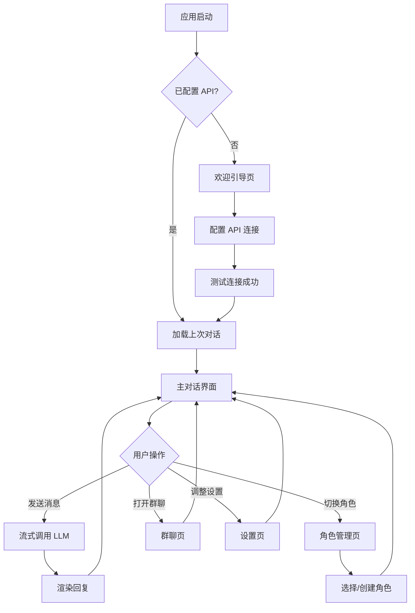

# 轻 Tavern — 简化版酒馆程序 PRD

## 1. 产品概述

**轻 Tavern** 是一款基于 SillyTavern 理念打造的 Windows 桌面端 AI 角色扮演客户端，采用 Electron + React 技术栈。它保留了酒馆生态的核心能力（角色卡、世界书、多后端接入、群聊、TTS、图片），同时大幅精简配置层级与界面复杂度，让新用户 3 分钟内即可完成首次对话。

- **目标用户**：希望体验 AI 角色扮演但被 SillyTavern 复杂配置劝退的普通用户；需要轻量化本地客户端的重度 RP 玩家。
- **核心价值**：开箱即用、一键连接、本地隐私、资源占用低（内存 < 300MB，安装包 < 120MB）。
- **差异化**：相比 SillyTavern 的"全能但繁琐"，轻 Tavern 主张"够用且优雅"——三步进入对话，所有高级选项折叠收纳。

## 2. 核心功能

### 2.1 用户角色

本产品为本地单机应用，无注册体系，所有用户共享本地存储的配置与数据。

### 2.2 功能模块

1. **对话页（主界面）**：流式对话、消息编辑/重生成、Markdown 渲染、上下文管理
2. **角色管理页**：角色卡列表、创建/编辑、导入导出（PNG/JSON）、快速切换
3. **设置页**：API 连接、模型选择、生成参数、主题外观、数据管理
4. **世界书页**：Lorebook 列表、条目编辑、关键词触发、启用/禁用
5. **预设页**：Prompt 预设管理、生成参数预设、快速应用
6. **群聊页**：多角色群组对话、发言顺序控制、自动接力
7. **帮助页**：新手引导、快捷键、FAQ、关于信息

### 2.3 页面详情

| 页面名称 | 模块名称 | 功能描述 |
|---------|---------|---------|
| 对话页 | 消息流 | 流式输出、气泡布局、头像显示、时间戳、Markdown/HTML 渲染 |
| 对话页 | 输入区 | 多行输入、发送/停止、图片附件、快速指令、TTS 播放按钮 |
| 对话页 | 上下文栏 | Token 计数、消息折叠、分支管理、清空对话 |
| 角色管理页 | 角色列表 | 卡片网格、搜索筛选、收藏置顶、最近对话 |
| 角色管理页 | 角色编辑器 | 头像、名字、描述、人设、首条消息、对话示例、标签 |
| 角色管理页 | 导入导出 | PNG 卡导入、JSON 导入导出、批量操作、Chub 链接导入 |
| 设置页 | API 连接 | 后端类型选择、密钥、Base URL、连接测试、模型列表拉取 |
| 设置页 | 模型参数 | 温度、Top-P、最大 token、频率惩罚、存在惩罚、上下文长度 |
| 设置页 | 外观主题 | 明暗模式、主题色、字体大小、气泡样式、背景图 |
| 设置页 | 数据管理 | 数据目录、导出备份、导入备份、重置 |
| 世界书页 | 条目列表 | 条目卡片、启用开关、关键词高亮、拖拽排序 |
| 世界书页 | 条目编辑 | 关键词、内容、插入位置、触发概率、递归触发 |
| 预设页 | 预设列表 | 内置预设、自定义预设、导入导出 |
| 预设页 | 预设编辑 | System Prompt、Jailbreak、上下文模板、变量插入 |
| 群聊页 | 群组管理 | 创建群组、添加成员、发言顺序、自动接力开关 |
| 群聊页 | 群聊对话 | 多角色气泡、当前发言者指示、手动指定下一位 |
| 帮助页 | 新手引导 | 3 步图文教程（连接 API → 选角色 → 开始对话） |
| 帮助页 | 快捷参考 | 快捷键表、常见问题、故障排查 |

## 3. 核心流程

### 3.1 首次使用流程
用户启动应用 → 进入欢迎页 → 点击"配置 AI 连接" → 选择后端类型 → 填入密钥/地址 → 测试连接 → 返回主界面 → 选择示例角色或创建角色 → 开始对话。

### 3.2 日常对话流程
用户打开应用 → 自动恢复上次对话 → 在输入框输入内容 → 点击发送 → AI 流式返回 → 可编辑/重生成/继续 → 可切换角色或群聊。

## 4. 用户界面设计

### 4.1 设计风格

- **整体调性**：现代极简 + 轻度奇幻氛围。避免 SillyTavern 的信息过载，采用"主对话区 + 折叠侧栏"的聚焦式布局。
- **主色调**：深色为主（`#1a1625` 深紫黑底），辅以琥珀金强调色（`#d4a574`），呼应"酒馆"的温暖灯光意象；浅色模式为米白底（`#f5f0e8`）+ 深棕主色。
- **按钮风格**：圆角矩形（8px），主按钮填充琥珀金，次按钮描边，危险操作暗红色。
- **字体**：界面用 "Noto Sans SC"（清晰中文），标题/角色名用 "Cinzel"（衬线奇幻感），代码块用 "JetBrains Mono"。
- **布局**：左侧可折叠导航栏（图标 + 文字），中间主内容区，右侧可折叠上下文面板。
- **图标**：使用 lucide-react 线性图标，统一 20px 描边。
- **动效**：消息出现淡入上滑、侧栏展开/收起平滑过渡、按钮 hover 微抬升。

### 4.2 页面设计概览

| 页面名称 | 模块名称 | UI 元素 |
|---------|---------|---------|
| 对话页 | 消息流 | 深色气泡背景、角色头像圆形、用户消息靠右琥珀边、AI 消息靠左紫色边 |
| 对话页 | 输入区 | 底部固定栏、多行文本框、附件图标、发送圆形按钮 |
| 对话页 | 顶栏 | 角色名 + 状态点、Token 计数、菜单按钮（清空/导出/设置） |
| 角色管理页 | 角色网格 | 3 列卡片、封面图、名字、标签、悬浮显示最近对话 |
| 角色管理页 | 编辑抽屉 | 右侧滑出抽屉、表单分组、实时预览 |
| 设置页 | 分区卡片 | API/模型/外观/数据四大分区、折叠展开 |
| 世界书页 | 条目列表 | 左侧条目列表、右侧编辑区、关键词标签彩色 |
| 群聊页 | 成员栏 | 顶部横向头像条、当前发言者高亮 |
| 帮助页 | 步骤卡片 | 大图引导卡、快捷键表格 |

### 4.3 响应式设计

桌面优先设计，最小窗口宽度 900px。窗口缩放时：
- ≥ 1200px：三栏布局（导航 + 主区 + 上下文面板）
- 900-1200px：两栏布局（导航 + 主区），上下文面板浮动
- 窗口高度自适应，消息流区域内部滚动

### 4.4 主题系统

- 深色模式（默认）/ 浅色模式 / 跟随系统
- 4 套预设主题色：琥珀金（默认）、翡翠绿、深海蓝、玫瑰粉
- 字体大小 3 档：舒适（16px）、紧凑（14px）、宽松（18px）
- 可自定义聊天背景图

## 5. 建议的附加功能

基于你"还可以有怎样的功能"的提问，以下功能建议纳入（按优先级）：

1. **对话分支**：从任意消息分叉出新对话线，便于尝试不同剧情走向（高价值）
2. **消息标注与收藏**：对喜欢的回复加星标注，便于回顾（低成本）
3. **快速指令**：预设 `/继续`、`/换一种`、`/总结` 等斜杠命令（提升效率）
4. **Token 用量统计**：按对话/角色/天统计 token 消耗与费用估算（成本管理）
5. **自动记忆摘要**：长对话自动生成摘要注入上下文，突破长度限制（核心痛点）
6. **角色卡市场直连**：内置浏览 Chub/RisuRealm 热门角色卡并一键导入（生态融合）
7. **对话导出为 Markdown/HTML**：便于分享与归档（实用）
8. **全局快捷键**：Ctrl+Enter 发送、Ctrl+R 重生成、Ctrl+K 快速切换角色（效率）

## 6. 非功能需求

- **性能**：冷启动 < 3 秒，消息流式首字延迟 < 500ms（网络除外），内存占用 < 300MB
- **稳定性**：API 调用失败自动重试 1 次，断网时缓存消息，恢复后可重发
- **隐私**：所有数据本地存储，API 密钥加密保存于系统凭据库（electron safeStorage）
- **兼容性**：Windows 10/11 x64，无需预装 Node.js 或其他运行时
- **可维护性**：模块化代码结构，主进程/渲染进程分离，AI 后端可插拔

## 7. 简化策略对比

| 维度 | SillyTavern | 轻 Tavern |
|------|-------------|-----------|
| 设置项数量 | 200+ | 30 以内 |
| 默认配置 | 需手动配置多项 | 开箱即用，仅需填 API |
| 角色卡字段 | 20+ 字段 | 8 核心字段，高级折叠 |
| 世界书触发逻辑 | 5 种位置 + 递归 | 简化为启用/关键词/位置 3 项 |
| 扩展系统 | 支持第三方扩展 | 内置功能，不支持扩展 |
| 用户引导 | 社区文档 | 应用内 3 步图文引导 |
