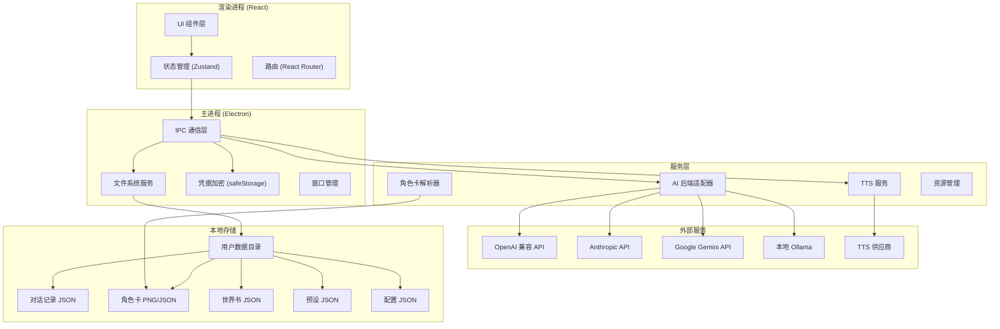
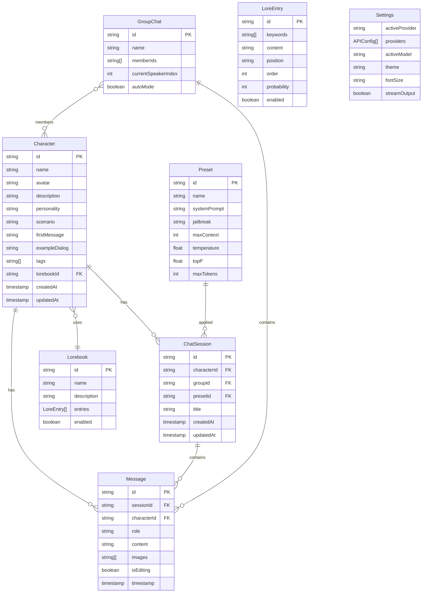

# 轻 Tavern — 技术架构文档

## 1. 架构设计



## 2. 技术说明

### 2.1 技术栈选型

| 层级 | 技术 | 版本 | 说明 |
|------|------|------|------|
| 桌面框架 | Electron | ^31.x | 跨平台桌面壳，Windows 打包 |
| 构建工具 | Vite | ^5.x | 渲染进程极速构建 |
| 前端框架 | React | ^18.x | 组件化 UI |
| 类型系统 | TypeScript | ^5.x | 全量类型安全 |
| 样式方案 | Tailwind CSS | ^3.x | 原子化 CSS，主题变量 |
| 状态管理 | Zustand | ^4.x | 轻量全局状态 |
| 路由 | React Router | ^6.x | 页面路由 |
| Electron 构建 | electron-builder | ^24.x | Windows NSIS 安装包 |
| IPC 桥接 | electron-context bridge | ^3.x | 安全上下文隔离 |
| 图标 | lucide-react | latest | 线性图标库 |
| Markdown | react-markdown + remark-gfm | latest | 消息渲染 |
| 高亮 | rehype-highlight | latest | 代码高亮 |

### 2.2 项目结构

```
酒馆/
├── electron/                  # Electron 主进程
│   ├── main.ts               # 主进程入口
│   ├── preload.ts            # 预加载脚本（contextBridge）
│   ├── ipc/                  # IPC 处理器
│   │   ├── chat.ts           # 对话相关
│   │   ├── character.ts      # 角色卡相关
│   │   ├── lorebook.ts       # 世界书相关
│   │   ├── preset.ts         # 预设相关
│   │   ├── settings.ts       # 设置相关
│   │   └── ai.ts             # AI 调用（流式）
│   └── services/             # 主进程服务
│       ├── storage.ts        # 文件系统封装
│       ├── safeStorage.ts    # 凭据加密
│       └── window.ts         # 窗口管理
├── src/                       # 渲染进程（React）
│   ├── main.tsx              # 渲染入口
│   ├── App.tsx               # 根组件 + 路由
│   ├── components/           # 通用组件
│   │   ├── chat/             # 对话组件
│   │   ├── character/        # 角色组件
│   │   ├── settings/         # 设置组件
│   │   ├── common/           # 通用 UI（按钮、弹窗等）
│   │   └── layout/           # 布局组件
│   ├── pages/                # 页面
│   │   ├── ChatPage.tsx
│   │   ├── CharactersPage.tsx
│   │   ├── SettingsPage.tsx
│   │   ├── LorebookPage.tsx
│   │   ├── PresetsPage.tsx
│   │   ├── GroupChatPage.tsx
│   │   └── HelpPage.tsx
│   ├── store/                # Zustand 状态
│   │   ├── useChatStore.ts
│   │   ├── useCharacterStore.ts
│   │   ├── useSettingsStore.ts
│   │   └── useUIStore.ts
│   ├── hooks/                # 自定义 Hooks
│   ├── types/                # 类型定义
│   │   ├── character.ts
│   │   ├── chat.ts
│   │   ├── lorebook.ts
│   │   ├── preset.ts
│   │   └── api.ts
│   ├── utils/                # 工具函数
│   │   ├── tokenCounter.ts
│   │   ├── markdown.ts
│   │   └── format.ts
│   └── styles/               # 全局样式
│       └── globals.css
├── shared/                    # 主进程/渲染进程共享类型
│   └── ipc-api.ts            # IPC 接口契约
├── resources/                 # 静态资源（图标、示例角色）
├── electron-builder.yml       # 打包配置
├── vite.config.ts
├── tailwind.config.js
├── tsconfig.json
└── package.json
```

## 3. 路由定义

| 路由 | 页面 | 说明 |
|------|------|------|
| `/` | 重定向到 `/chat` | 默认进入对话 |
| `/chat` | 对话页 | 主界面，支持单角色与群聊切换 |
| `/characters` | 角色管理页 | 角色卡列表与编辑 |
| `/settings` | 设置页 | API、模型、外观、数据 |
| `/lorebook` | 世界书页 | Lorebook 管理 |
| `/presets` | 预设页 | Prompt 与参数预设 |
| `/group` | 群聊管理页 | 群组创建与管理 |
| `/help` | 帮助页 | 引导与文档 |

## 4. IPC 接口定义

### 4.1 接口契约（shared/ipc-api.ts）

```typescript
// AI 调用接口
interface AIApi {
  chat(params: ChatParams): Promise<void>;  // 流式，通过事件回调
  cancelChat(requestId: string): Promise<void>;
  testConnection(config: APIConfig): Promise<{ success: boolean; models?: string[]; error?: string }>;
}

// 角色卡接口
interface CharacterApi {
  list(): Promise<Character[]>;
  get(id: string): Promise<Character | null>;
  save(character: Character): Promise<void>;
  delete(id: string): Promise<void>;
  importPng(filePath: string): Promise<Character>;
  importJson(filePath: string): Promise<Character>;
  exportPng(id: string, savePath: string): Promise<void>;
  exportJson(id: string, savePath: string): Promise<void>;
}

// 对话接口
interface ChatApi {
  listMessages(characterId: string): Promise<Message[]>;
  saveMessage(message: Message): Promise<void>;
  deleteMessage(id: string): Promise<void>;
  clearChat(characterId: string): Promise<void>;
  exportChat(characterId: string, format: 'md' | 'json'): Promise<string>;
}

// 世界书接口
interface LorebookApi {
  list(): Promise<Lorebook[]>;
  save(lorebook: Lorebook): Promise<void>;
  delete(id: string): Promise<void>;
  importJson(filePath: string): Promise<Lorebook>;
}

// 设置接口
interface SettingsApi {
  get(): Promise<Settings>;
  save(settings: Settings): Promise<void>;
  saveAPICredential(provider: string, key: string): Promise<void>;  // 加密存储
  getAPICredential(provider: string): Promise<string | null>;
  exportBackup(): Promise<string>;
  importBackup(filePath: string): Promise<void>;
}

// TTS 接口
interface TTSApi {
  speak(text: string, options: TTSOptions): Promise<void>;
  stop(): Promise<void>;
  listVoices(provider: string): Promise<Voice[]>;
}
```

### 4.2 AI 后端适配器

```typescript
// 统一的 AI 适配器接口
interface AIAdapter {
  name: string;
  chat(params: ChatParams, onChunk: (text: string) => void): AsyncGenerator<string>;
  listModels(config: APIConfig): Promise<string[]>;
  validateConfig(config: APIConfig): Promise<boolean>;
}

// 实现 4 个适配器
class OpenAICompatibleAdapter implements AIAdapter { /* OpenAI/DeepSeek/Kimi 等 */ }
class ClaudeAdapter implements AIAdapter { /* Anthropic 原生 */ }
class GeminiAdapter implements AIAdapter { /* Google Gemini */ }
class OllamaAdapter implements AIAdapter { /* 本地 Ollama */ }
```

## 5. 数据模型

### 5.1 数据模型定义



### 5.2 存储路径

```
%APPDATA%/轻Tavern/
├── config/
│   ├── settings.json          # 应用设置
│   └── providers.enc           # 加密的 API 凭据
├── characters/
│   ├── [id].json              # 角色元数据
│   └── [id].png               # 角色头像/卡图
├── chats/
│   └── [characterId]/
│       └── messages.jsonl     # 对话记录（行分隔 JSON）
├── lorebooks/
│   └── [id].json
├── presets/
│   └── [id].json
├── groups/
│   └── [id].json
└── backups/                   # 备份目录
```

## 6. 关键技术决策

### 6.1 安全性
- **上下文隔离**：`contextIsolation: true`，`nodeIntegration: false`
- **凭据加密**：API Key 使用 Electron `safeStorage` API 加密存储
- **IPC 白名单**：仅暴露必要的 API 通道，参数校验

### 6.2 流式输出
- 主进程通过 `EventEmitter` 或 IPC `webContents.send` 推送 chunk
- 渲染进程订阅事件，增量更新消息内容
- 支持 `AbortController` 取消请求

### 6.3 角色卡兼容
- 支持解析 SillyTavern Character Card V2/V3 规范
- PNG 卡通过读取 tEXt chunk `chara` 字段（base64 编码 JSON）
- 导出时写回 PNG 元数据，保持与 SillyTavern 互导

### 6.4 世界书触发
- 简化触发逻辑：扫描最近 N 条消息的关键词 → 匹配条目 → 按位置注入
- 位置选项：`before_char`（角色描述前）、`after_char`（角色描述后）、`at_end`（末尾）
- 递归触发默认关闭（可开启）

### 6.5 打包配置
- 使用 `electron-builder` 生成 NSIS 安装包
- 目标：`win-x64`，安装包体积 < 120MB
- 应用图标：自定义酒馆风格图标
- 自动更新：预留 `electron-updater` 接口（首版不启用）
