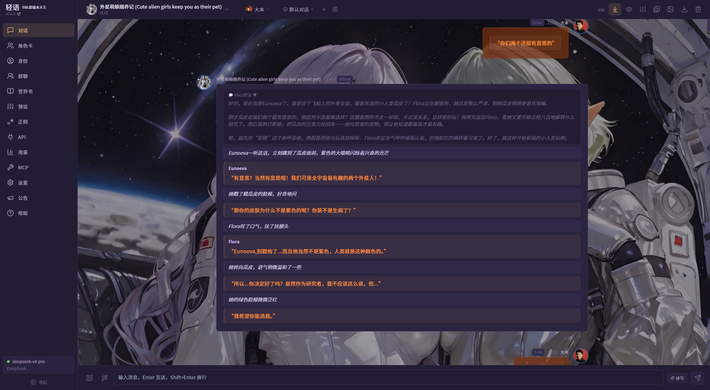
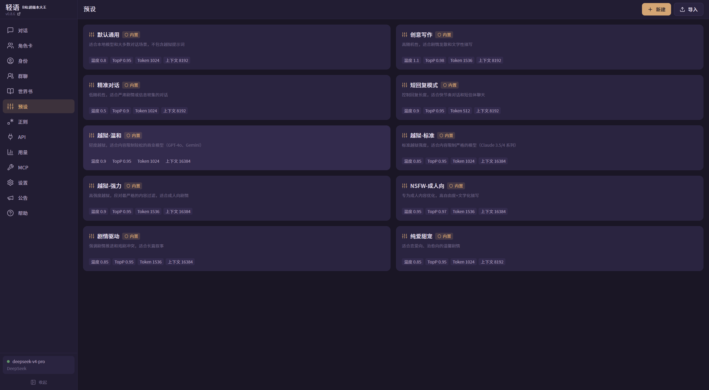
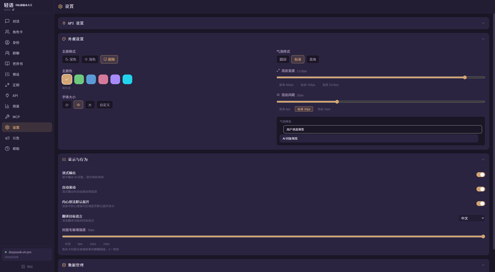
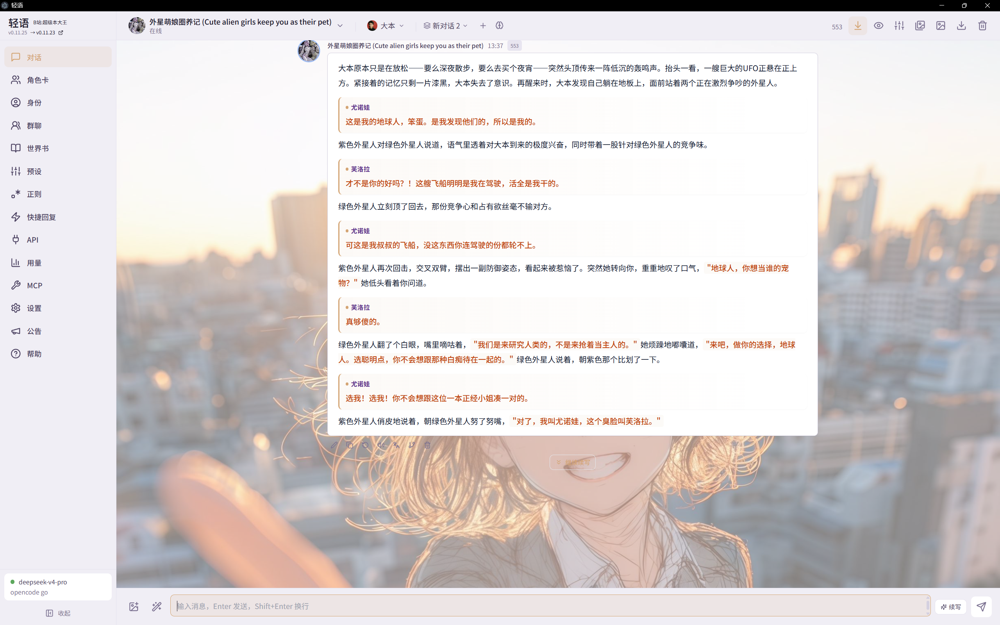
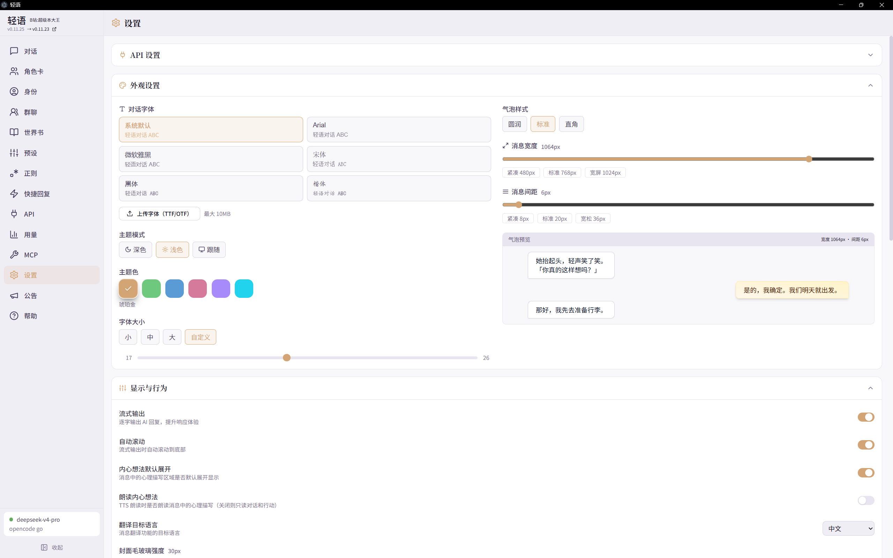
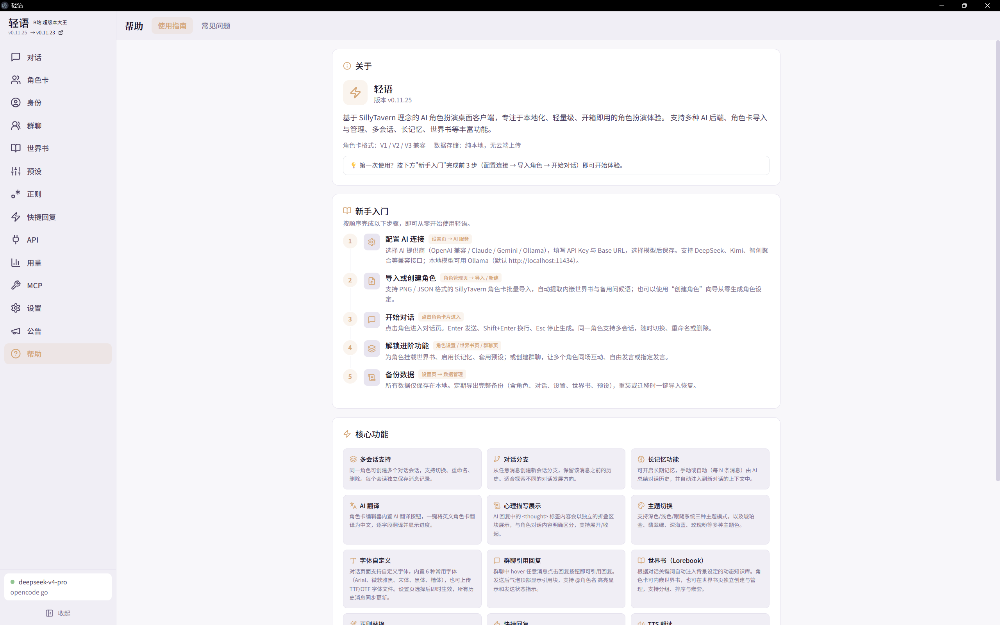

# 🍶 轻语 QingYu

> 轻量级 AI 角色扮演桌面客户端 — 基于 SillyTavern 理念，专注本地化、开箱即用体验。

<p align="center">
  
  
  
  
  
  
  
  
</p>

---

## 📦 仓库结构

本仓库包含三个协同发布的子项目：

| 子项目 | 路径 | Git 仓库 | 说明 | 版本 |
|--------|------|----------|------|------|
| **桌面客户端** | `./` | `GUAPIXIA/qingyu`（main） | Electron + React 主应用 | v0.11.26 |
| **安卓伴侣端** | `android/` | 同一仓库 | 远程连接与对话消费（配对 PC 使用） | v0.1.4 |
| **公告服务端** | `server/` | 同一仓库 | 在线公告 / 版本信息推送（可独立 Docker 部署） | v1.0.3 |

> `android/` 与 `server/` 已纳入本仓库统一管理；本地 `.env`、数据库与构建产物仍不纳入版本控制。

---

## 📸 程序截图

### 🌙 深色主题

| 对话页面 | 对话预设 |
|:---:|:---:|
|  |  |
| **角色卡页面** | **设置页面** |
|  |  |

### ☀️ 浅色主题

| 主页面 | 角色卡页面 |
|:---:|:---:|
|  |  |
| **设置页面** | **关于页面** |
|  |  |

---

## ✨ 桌面客户端功能特性

### 🤖 AI 对话
- **多后端支持** — OpenAI 兼容接口 / Anthropic Claude / Google Gemini / Ollama，支持自定义 Base URL
- **流式输出** — 逐字实时显示 AI 回复，可随时中断
- **对话分支** — 从任意消息创建新分支，自由探索不同故事走向
- **长记忆** — AI 自动总结对话历史，基于 Token 预算智能注入上下文
- **对话翻译** — 消息级中英互译，Markdown 格式无损保留
- **心理描写** — `<thought>` 标签折叠展示，与角色对话内容明确区分
- **Swipe 切换** — 支持多候选回复，左右滑动切换满意的回复

### 👥 群聊系统
- **三种协作模式**：@点名（mention）、轮询（polling）、自由发言（free）
- **多角色实时对话**，成员可动态增减
- **独立会话管理**，群聊与单聊互不干扰

### 🎭 角色管理
- **完整兼容** SillyTavern Character Card V1 / V2 / V3（PNG + JSON）
- **批量导入** — 多文件一次性导入，自动提取内嵌世界书
- **无损翻译** — AI 一键翻译角色卡（英 → 中），译文存独立字段，原文不丢失
- **角色封面** — 支持自定义封面图，可设为聊天页半透明背景

### 🖼️ 图片生成
- **SD WebUI / OpenAI DALL-E** 双引擎支持（ComfyUI 规划中）
- 对话中 `/imagine` 命令生图，自动提取提示词
- 中文提示词自动翻译为英文，提升出图质量
- 多尺寸 / 多质量预设，灵活切换

### 📚 世界书（Lorebook）
- **关键词动态触发** — 检测到关键词时自动注入角色背景设定，支持正则匹配
- **语义触发（向量 RAG）** — 按语义相似度触发条目（如"猫娘"可触发含"猫咪"的条目），支持 OpenAI 兼容 / Ollama 嵌入服务
- **语义索引管理** — 条目内容修改后自动标记过期，重新生成索引即可更新
- **条目管理** — 选择性启用、权重排序、递归扫描深度控制
- 深度注入 / 双层级（全局+角色内嵌）已支持，LLM 匹配规划中

### 🎛️ 预设系统
- **对话预设** — 可切换的 System Prompt 模板，配合角色使用
- **正则替换** — 批量输入/输出规则，支持前后处理管线
- 内置多种常用预设，开箱即用

### 📢 在线公告（v0.8.1+）
- 侧栏「公告」入口，拉取服务器在线公告
- 支持 **Markdown 富文本**渲染（表格、代码块、图片等）
- **离线缓存** — 网络不可达时自动使用本地缓存
- **版本检查** — 从公告服务器获取 PC / 安卓端最新版本号
- 配套 **Docker 一键部署** 的服务端 + Web 管理后台（见 [`server/`](./server/)）

### 🎨 主题与外观
- 深色 / 浅色 / 跟随系统 **三模式切换**
- **6 种主题色**：琥珀金、翡翠绿、深海蓝、玫瑰粉、星夜紫、碧波青
- 气泡圆角三档可调（圆润 / 标准 / 锐利）
- 字体大小四档 + 自定义

### 🔊 更多
- **TTS 语音合成** — Windows 系统语音 + Edge TTS（免费高质量网络语音）（Fish Audio / OpenAI TTS 规划中）
- **MCP 工具集成** — 支持 Model Context Protocol，扩展 AI 能力
- **斜杠命令** — `/help`、`/imagine`、`/continue` 等 14 个内置命令
- **Token 用量统计** — 按模型/角色/日期多维度统计，费用自动估算（tiktoken 精确计数）
- **用户人设（Persona）** — 支持多用户身份切换

### 🔒 数据安全
- **纯本地存储** — 所有数据在本地 AppData，无云端上传
- **一键备份** — 完整导出/导入（角色、对话、设置、世界书、预设）
- **API Key 加密** — 系统级安全加密存储

---

## 📱 安卓伴侣端（[android/](./android/README.md)）

PC 端「轻语」的安卓伴侣端：**只做远程连接与对话消费，不做本地 AI 对话**。

- **扫码配对**（ZXing）+ mDNS 自动发现 + 已配对设备管理
- **单聊**：流式接收、断线自动重发、长按操作（翻译/重新生成/朗读/引用回复）、swipe 候选、快捷回复
- **多模态**：图片消息、TTS 音频流播放（ExoPlayer）、心理描写折叠、Markdown 渲染
- **阶段三**：用量统计、公告同步、**检查更新**（从公告服务器获取最新版本号）
- **离线只读**：Room 缓存最近会话，断网可回看

```bash
cd android
./gradlew assembleDebug        # 构建 Debug APK
./gradlew testDebugUnitTest    # 运行单元测试
```

> 完整方案见 `docs/安卓伴侣端方案.md`（位于仓库 docs 目录）。

---

## 🚀 快速开始

### 桌面端（Windows）

```bash
# 安装依赖（需要 pnpm 10+ / Node 20+）
pnpm install

# 开发模式（Electron + Vite HMR）
pnpm electron:dev

# 生产构建（NSIS 安装包）
pnpm electron:build

# 测试
pnpm test
```

### 在线公告服务端（可选部署）

公告服务在 [`server/`](./server/)，支持 Docker 一键部署，详见 [`server/README.md`](./server/README.md)：

```bash
cd server
cp .env.example .env          # 配置 JWT_SECRET 与 ADMIN_PASSWORD（强密码）
docker compose up -d          # 或 npm install && npm start
```

- 管理后台：`http://你的域名/qingyu/admin`
- 公告 API：`http://你的域名/qingyu/api/announcements`
- 版本 API：`http://你的域名/qingyu/api/version`（PC / 安卓端独立版本号配置）
- 桌面端默认公告服务器地址在 `electron/ipc/announcement.ts` 中修改（默认 `http://cjbtj.xyz/qingyu`）

---

## 🛠️ 技术栈

| 层 | 技术 |
|---|------|
| 桌面框架 | Electron 43 |
| 前端 | React 18 + TypeScript 5 |
| 构建工具 | Vite 6 + esbuild |
| UI 框架 | Tailwind CSS 3（CSS 变量主题系统） |
| 状态管理 | Zustand 5 |
| 路由 | react-router-dom 7（HashRouter） |
| Markdown | react-markdown + remark-gfm + rehype-raw + rehype-highlight |
| 虚拟滚动 | react-virtuoso |
| 图标 | lucide-react |
| 打包 | electron-builder（NSIS） |
| 安卓端 | Kotlin + Jetpack Compose + Retrofit/OkHttp + Room + Media3（见 [android/README.md](./android/README.md)） |
| 服务端 | Express + better-sqlite3 + JWT + Docker（见 [server/README.md](./server/README.md)） |

---

## 📁 项目结构

```
qingyu/
├── src/                        # 前端 React 代码
│   ├── main.tsx                # React 入口
│   ├── App.tsx                 # 根组件（路由 + 主题初始化）
│   ├── index.css               # 全局样式（CSS 变量 + Tailwind）
│   ├── components/             # api / character / chat / common / layout
│   ├── pages/                  # 路由页面（Chat / GroupChat / Characters / Announcements …）
│   ├── store/                  # Zustand 状态管理（单聊/群聊 store + 共享模块）
│   ├── commands/               # 斜杠命令系统
│   └── utils/                  # 工具函数
├── electron/                   # Electron 主进程
│   ├── main.ts                 # 主进程入口
│   ├── preload.ts              # 预加载脚本（contextBridge）
│   ├── ipc/                    # IPC 处理器模块
│   ├── services/               # 后端服务（AI、存储、生图等）
│   ├── bridge/                 # 安卓伴侣端桥接层（REST + WebSocket + 配对认证 + mDNS）
│   └── mcp/                    # MCP 协议实现
├── shared/                     # 前后端共享（types.ts / ipc-api.ts / ipc-channels.ts）
├── android/                    # 安卓伴侣端（独立子项目，见其 README）
└── server/                     # 公告服务端（独立子项目，见其 README）
```

---

## ⌨️ 快捷键

| 按键 | 功能 |
|------|------|
| `Enter` | 发送消息 |
| `Shift + Enter` | 换行 |
| `Esc` | 关闭弹窗 / 停止生成 |

---

## 📝 更新日志

- 主应用：[CHANGELOG.md](./CHANGELOG.md)
- 安卓伴侣端：[android/CHANGELOG.md](./android/CHANGELOG.md)
- 公告服务端：[server/CHANGELOG.md](./server/CHANGELOG.md)

---

## 📄 开源协议

[MIT License](LICENSE)
