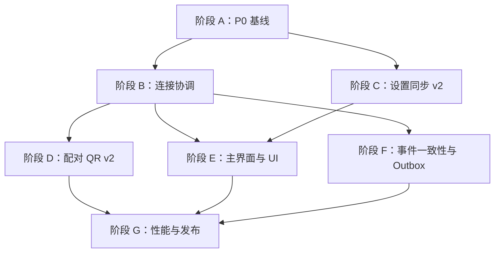

# 轻语安卓端补全、完善与优化实施文档

> 文档日期：2026-08-29  
> 关联方案：`docs/已移除/安卓端补全完善与优化方案-2026-08-29.md`（同批归档）  
> 实施范围：`android/`、`electron/bridge/`、必要的共享协议与发布脚本  
> 目标读者：负责 Android、PC Bridge、测试与发布的开发人员  
> 当前版本事实：PC `package.json = 0.16.6`；Android Gradle `0.16.5 / versionCode 6`；Android README 仍记录 `0.1.5 / build 6`

## 1. 文档目标

本文不是功能愿望清单，而是上一份优化方案的工程实施说明。它回答以下问题：

- 先改什么，后改什么，阶段之间有哪些依赖。
- 每个阶段需要新增或修改哪些文件。
- 数据模型、REST、WebSocket 和 Room 如何兼容升级。
- Android 和 PC 应分别承担什么职责。
- 每个任务如何测试、验收、灰度和回滚。

本轮的核心交付不是“更多页面”，而是形成以下闭环：

```text
已配对启动直达 -> 快速恢复连接 -> 设置可确认同步
-> 消息弱网不丢不重 -> UI 状态统一 -> 可测试、可发布、可回滚
```

## 2. 实施原则

### 2.1 兼容优先

- 旧 Android 仍需能连接升级后的 PC Bridge。
- 新 Android 连接旧 PC 时必须能力降级，而不是直接崩溃。
- 不直接改变现有 `/api/v1/settings` 的响应结构；新增同步端点完成渐进升级。
- QR v2 上线后继续接受旧 `{host, port, fingerprint}` 二维码至少一个发布周期。
- Room 中发件箱属于不可重建数据，不再使用破坏性迁移处理其 schema 变化。

### 2.2 数据所有权先于同步

- Android 本机显示、隐私和通知设置只存 Android。
- 模型、预设、翻译语言等 PC 全局设置以 PC 为权威。
- 世界书、长记忆、会话预设等以 PC 会话为权威。
- API Key、Profile 凭据、私钥永不下发 Android。

### 2.3 可观测后优化

- 连接、配对、首屏、发送和流式延迟必须先产生本地指标。
- 超时调整必须依据 P50/P95 数据，不用“感觉更快”代替证据。
- 所有丢弃事件、补拉、重试和冲突都需要计数。

### 2.4 小步可回滚

- 每一阶段独立可发布。
- 协议新能力以 `capabilities` 开关控制。
- 新 UI 可以通过本地 feature flag 回退到旧入口，直至主路径验证完成。
- 不把连接重构、设置同步、UI 换壳和数据库升级塞进同一个提交。

---

## 3. 当前代码基线与改造边界

### 3.1 Android 现有关键组件

| 职责 | 当前文件 | 本轮处理 |
| --- | --- | --- |
| 应用对象图 | `data/AppContainer.kt` | 保留手动 DI，新增 coordinator/repository |
| 连接存储 | `data/DataStoreConnectionStore.kt` | 扩充连接元数据，兼容旧 JSON |
| 本机偏好 | `data/UiPrefsStore.kt` | 保持本机权威，不并入 PC 同步 |
| 缓存/发件箱 | `data/CacheDatabase.kt`、`CacheEntities.kt` | 增加显式 migration 和设备隔离字段 |
| 数据入口 | `data/ChatRepository.kt`、`OnlineChatRepository.kt` | 拆出设置同步和连接协调职责 |
| HTTP | `network/NetworkModule.kt` | 端点规范化、Client 复用、安全策略 |
| 连接管理 | `network/ConnectionManagerImpl.kt` | 逐步迁移到 `ConnectionCoordinator` |
| WebSocket | `network/WsClientImpl.kt` | 连接代次、网络恢复、事件缺口指标 |
| mDNS | `network/NsdDiscovery.kt` | 输出候选地址，不直接决定最终连接 |
| 导航 | `ui/navigation/CompanionNavHost.kt` | 增加启动决策和 MainShell |
| 设置 | `ui/settings/SettingsScreen.kt` | 修主题控件，重组本机/PC 设置 |
| 快捷设置 | `ui/components/QuickSettingsPanel.kt` | 接入设置快照和统一保存状态 |
| 聊天 | `ui/chat/ChatViewModel.kt`、`ChatScreen.kt` | 可靠发送细分、输入区和错误动作 |

### 3.2 PC 现有关键组件

| 职责 | 当前文件 | 本轮处理 |
| --- | --- | --- |
| Bridge 生命周期/配对信息 | `electron/bridge/index.ts` | QR v2、serverId、设置变更转发 |
| HTTP Server | `electron/bridge/server.ts` | 挂载新同步端点，保持 v1 兼容 |
| REST 路由 | `electron/bridge/routes.ts` | 新增 snapshot/settings patch v2 |
| WS Hub | `electron/bridge/ws.ts` | 新增 capabilities/settings 事件 |
| Task v2 | `electron/bridge/taskRoutes.ts`、`taskWsAdapter.ts` | Android 后续复用 sequence 能力 |
| PC 设置写入 | `electron/ipc/settings.ts`、相关 store | 统一触发 settings change bus |
| mDNS | `electron/bridge/mdns.ts` | 广播稳定 serverId/capabilities |

### 3.3 当前必须先确认的事实

1. `network_security_config.xml` 生效配置禁止所有明文，但 `NetworkModule` 对私网生成 `http/ws`。Android 9+ 可能在平台层直接拒绝请求。
2. `CompanionNavHost` 固定以 `PAIRING` 为起点，即使已有连接也多走一层。
3. `SettingsScreen.OptionPickerRow` 点击后仍提交当前选项，主题选择无法切换。
4. `WsClientImpl`、REST、Coil 各自建立/持有网络 Client，资源和连接选择未统一。
5. PC 已有 `/api/v2/tasks/:taskId/events?afterSequence=`，不要在 Android 侧另造一套不兼容的任务事件协议。
6. `CacheDatabase` 当前 `version = 4` 且全库 `fallbackToDestructiveMigration()`，扩充 Outbox 前必须先改变迁移策略。

---

## 4. 总体里程碑与依赖



推荐发布节奏：

| 发布 | 内容 | 目标 |
| --- | --- | --- |
| Android 0.16.6-p1 | 阶段 A | 修复阻塞项、恢复可信基线 |
| Android 0.17.0 | 阶段 B + D 基础 | 启动直达、连接更快、QR 兼容升级 |
| Android 0.17.1 | 阶段 C | 设置有版本、有保存状态、有冲突 |
| Android 0.18.0 | 阶段 E | MainShell、自适应与统一状态 |
| Android 0.18.1 | 阶段 F + G | 最终一致性、迁移、性能和发布收口 |

版本号只是建议，实际以项目版本规范为准；关键是每阶段可以独立回退。

---

## 5. 阶段 A：P0 基线收口

预计 2～4 个工作日。本阶段不做大重构，只修复当前确定问题并建立门禁。

### A-01 版本单源

#### 当前问题

- PC `package.json` 为 `0.16.6`。
- Android `libs.versions.toml` 为 `0.16.5 / versionCode 6`。
- Android README/CHANGELOG 仍有 `0.1.5` 语义。
- `versionCode` 没有随大量版本变化递增，未来覆盖安装会失败。

#### 实施

扩展现有 `scripts/version.mjs`，让它支持以下权威字段：

```text
PC: package.json.version
Android: android/gradle/libs.versions.toml
  - appVersionName
  - appVersionCode
Docs: 只校验，不把 README 作为权威来源
```

增加命令：

```text
pnpm version:status      # 展示 PC/Android/README/CHANGELOG 是否一致
pnpm version:android     # 仅递增 Android versionCode，并同步 versionName
pnpm version:release     # 统一发布版本
```

文档版本行建议由脚本生成或校验，不再手写多个权威值。

#### 测试

- 解析带注释的 TOML 不破坏格式。
- versionName 改变时 versionCode 必须增大。
- CI 检测 README/CHANGELOG 与 Gradle 不一致并失败。

#### 验收

- `pnpm version:status` 返回一致。
- Android 新 APK 可覆盖安装上一版本。

### A-02 修复主题选择

#### 当前问题

`SettingsScreen.kt` 的 `OptionPickerRow` 只接收当前 `selected`，点击调用 `onSelect(selected)`，没有产生其他候选值。

#### 推荐实现

新增公共组件 `ui/components/SettingsChoiceSheet.kt`：

```kotlin
@Composable
fun <T> SettingsChoiceRow(
    title: String,
    selected: T,
    options: List<T>,
    labelOf: (T) -> String,
    onSelect: (T) -> Unit,
)
```

点击后打开 `ModalBottomSheet`，用 `SelectRow` 展示全部项。主题、字号、间距均复用，删除设置页内重复的展开逻辑。

#### 测试

- 初始 SYSTEM，选择 LIGHT 后 DataStore 为 LIGHT。
- Activity 重建和 App 重启后仍是 LIGHT。
- 选择当前项不产生重复写入。

### A-03 已配对启动直达

#### 新增模型

新增 `ui/startup/StartupViewModel.kt`：

```kotlin
sealed interface StartupState {
    data object LoadingLocalState : StartupState
    data object NeedsPairing : StartupState
    data class Ready(val activeDeviceId: String) : StartupState
    data class ReadyWithoutActive(val connections: List<ServerConnection>) : StartupState
}
```

新增 `StartupRepository` 或在 `ConnectionManager` 增加只读方法：

```kotlin
suspend fun loadStartupSnapshot(): StartupSnapshot
```

该方法只读 DataStore，不能等待 DNS、REST 或 WS。

#### 导航调整

`CompanionNavHost` 的固定起点改为 `Routes.STARTUP`：

```text
STARTUP
├─ NeedsPairing -> PAIRING
├─ Ready -> SESSIONS，pop STARTUP
└─ ReadyWithoutActive -> CONNECTION_PICKER
```

`AppContainer.start()` 仍可异步 `restore()`；导航只依据本地快照。会话页进入后先展示 Room，再等待网络刷新。

#### 边界条件

- 有连接但 active id 丢失：展示设备选择，不擅自选错 PC。
- active token 解密失败：进入会话缓存，同时显示“需要修复连接”。
- 401：不删除缓存，不自动移除设备。
- 从通知进入某会话：启动决策完成后再消费 deep link。

#### 验收

- 有效连接冷启动不出现配对页闪烁。
- 飞行模式下仍在 800ms 内看到缓存会话。
- 无连接才进入配对页。

### A-04 端点规范化与明文策略

#### 当前矛盾

Android 当前为：

```text
私网 -> NetworkModule 生成 http/ws
Manifest/network security -> 禁止全部 cleartext
```

注释中的 `<domain-config>` 没有启用，而且 Android Network Security Config 不能用 CIDR 通配全部动态局域网 IP。单纯加入 `10.0.0.0` 也不会匹配 `10.1.2.3`。

依据 [Android 官方 Network Security Configuration 文档](https://developer.android.com/privacy-and-security/security-config)，目标 Android 9+ 的应用默认禁止明文；需要对任意动态目标启用时只能由 `base-config cleartextTrafficPermitted="true"` 放行。项目 minSdk 为 26 且已经声明 Network Security Config，因此 API 24+ 实际以该 XML 为准，Manifest 的 `usesCleartextTraffic` 不负责覆盖它，详见 [`<application>` 属性说明](https://developer.android.com/guide/topics/manifest/application-element.html)。

#### 短期可用方案

1. 将 `network_security_config.xml` 的 base cleartext 临时设为允许。
2. 在应用代码建立严格 `EndpointPolicy`，只有明确判定为本地的地址允许 `http/ws`。
3. 拒绝 HTTP 重定向到非本地明文地址。
4. 公网域名和公网 IP 强制 `https/wss`。
5. 增加安全回归测试，保证调用方无法手工构造公网 `http`。

短期允许平台明文只是为了动态私网 IP 可用，不代表任意地址可明文连接。安全边界必须在唯一的端点构建器中强制执行。

#### 长期方案

PC Bridge 为局域网生成本机 TLS 证书，QR v2 下发证书公钥指纹；Android 首次配对固定指纹。完成后重新关闭平台 cleartext。该项放在阶段 D，不阻塞短期恢复连接。

#### 新增类型

建议新增：

```kotlin
enum class TransportSecurity { LOCAL_CLEARTEXT, TLS_PINNED, TLS_SYSTEM }

@Serializable
data class ConnectionEndpoint(
    val host: String,
    val port: Int,
    val security: TransportSecurity,
    val certificatePin: String? = null,
)
```

新增 `network/EndpointNormalizer.kt`：

- 识别 IPv4 私网、100.64/10、localhost。
- 识别 IPv6 loopback、ULA `fc00::/7`、link-local `fe80::/10`。
- `.local` 和 mDNS 返回地址视为本地候选。
- IPv6 生成 URL 时使用 `[address]`。
- 去除用户输入的 scheme、路径、尾斜线和空白。
- 国际域名/普通域名默认 TLS_SYSTEM。

所有 REST、WS、Coil、TTS 只能从 `ConnectionEndpoint` 生成 URL，不再各自拼字符串。

#### 测试表

| 输入 | 预期 |
| --- | --- |
| `192.168.1.5` | LOCAL_CLEARTEXT |
| `10.0.0.8` | LOCAL_CLEARTEXT |
| `100.100.1.2` | LOCAL_CLEARTEXT |
| `172.20.1.5` | LOCAL_CLEARTEXT |
| `qingyu-pc.local` | LOCAL_CLEARTEXT |
| `fd00::1234` | LOCAL_CLEARTEXT + `[fd00::1234]` |
| `fe80::1%wlan0` | LOCAL_CLEARTEXT，正确编码 zone id |
| `example.com` | TLS_SYSTEM |
| `8.8.8.8` | TLS_SYSTEM |
| 公网地址 + LOCAL_CLEARTEXT | 构造失败 |

### A-05 通知权限延迟申请

#### 修改

- 删除 `MainActivity.onCreate()` 中的启动即申请。
- `SettingsScreen` 打开任务通知时，先显示用途说明，再请求系统权限。
- 用户首次发起可能在后台完成的生成任务时，如果未授权，显示非阻塞说明；拒绝后仍能正常生成。
- 不反复弹系统权限；被永久拒绝后提供“前往系统设置”。

#### 验收

- 首次启动不出现通知权限框。
- 未授权不会影响连接、配对和发消息。
- 开启通知后渠道设置与 App 内开关一致。

### A-06 恢复构建门禁

在能够正常建立本机 Java loopback 的环境执行：

```powershell
cd android
.\gradlew.bat testDebugUnitTest --console=plain
.\gradlew.bat lintDebug --console=plain
.\gradlew.bat assembleDebug --console=plain
```

PC：

```powershell
pnpm check
pnpm lint
pnpm test
pnpm build
```

当前工作机若仍报 `PipeImpl/WEPollSelector Unable to establish loopback connection`，先修复 JDK/Windows 本地网络环境；不能把该环境故障归为项目测试失败，也不能因此跳过 CI。

---

## 6. 阶段 B：连接协调与延迟优化

预计 5～7 个工作日。

### B-01 引入 ConnectionCoordinator

#### 目标

把“存了哪个 PC”“当前尝试哪个地址”“WS 状态是什么”“为何失败”从多个类收敛成一条状态流。

#### 新增文件

```text
android/app/src/main/java/com/qingyu/companion/network/connection/
├── ConnectionCoordinator.kt
├── ConnectionState.kt
├── ConnectionAttempt.kt
├── ConnectivityObserver.kt
├── EndpointProbe.kt
├── EndpointNormalizer.kt
└── ConnectionMetrics.kt
```

#### 状态模型

```kotlin
sealed interface ConnectionState {
    data object Idle : ConnectionState
    data class Discovering(val deviceId: String) : ConnectionState
    data class Probing(val deviceId: String, val candidates: List<ConnectionEndpoint>) : ConnectionState
    data class AwaitingApproval(val serverName: String, val expiresAt: Long) : ConnectionState
    data class Authenticating(val endpoint: ConnectionEndpoint) : ConnectionState
    data class ConnectingRealtime(val endpoint: ConnectionEndpoint) : ConnectionState
    data class Connected(
        val deviceId: String,
        val endpoint: ConnectionEndpoint,
        val connectedAt: Long,
        val rttMs: Long,
    ) : ConnectionState
    data class Degraded(val restAvailable: Boolean, val wsAvailable: Boolean, val reason: FailureReason) : ConnectionState
    data class Reconnecting(val attempt: Int, val nextAttemptAt: Long, val reason: FailureReason) : ConnectionState
    data class NeedsRepair(val deviceId: String, val reason: RepairReason) : ConnectionState
}
```

`FailureReason` 至少区分：NoNetwork、Dns、Tcp、Tls、Timeout、ServerStopped、WsClosed、Unknown。  
`RepairReason` 至少区分：Unauthorized、FingerprintChanged、ApiIncompatible、CertificateChanged。

#### 职责划分

- `ConnectionStore`：只负责持久化。
- `ConnectionCoordinator`：决定连接目标与状态。
- `NetworkModule`：创建/复用网络对象。
- `WsClient`：只建立指定 endpoint 的实时连接，不自行选择设备。
- ViewModel：只消费 coordinator 状态，不拼接网络错误。

迁移期让现有 `ConnectionManager` 委托给 coordinator，保持调用方不一次性全改。

### B-02 扩充 ServerConnection

保持旧字段有默认兼容，新增：

```kotlin
@Serializable
data class ServerConnection(
    val name: String,
    val host: String,
    val port: Int,
    val token: String,
    val deviceId: String,
    val fingerprint: String,
    val serverId: String? = null,
    val pairingProtocolVersion: Int = 1,
    val endpoints: List<ConnectionEndpoint> = emptyList(),
    val lastSuccessfulEndpoint: ConnectionEndpoint? = null,
    val lastConnectedAt: Long = 0,
    val capabilities: Set<String> = emptySet(),
)
```

旧记录加载时：

- `serverId = null`，仍使用 deviceId 作为本地索引。
- 用旧 host/port 合成一个 endpoint。
- 首次成功握手后回填 serverId/capabilities。
- 不在读取阶段删除旧 fingerprint 或 token。

### B-03 候选地址竞速

候选来源：

1. 上次成功 endpoint。
2. QR 保存 endpoints。
3. mDNS 当前发现 endpoint。
4. 用户手动 endpoint。

规则：

- 同一 host/port/security 去重。
- 上次成功地址立即探测。
- 其他候选延迟 150ms 并发启动，最多 3 个在途。
- 探测使用轻量 `GET /api/v1/server/info`，单次连接超时建议 1.5～2.5s。
- 首个 serverId/capabilities 匹配的成功候选胜出，取消其他请求。
- serverId 不匹配不能因为“响应快”就接受。

不要对配对请求使用过短 read timeout：PC 人工确认当前最多等待 55 秒，应使用独立 pairing Client 或异步配对协议。

### B-04 共享 OkHttp 基础设施

`NetworkModule` 改为实例或 `NetworkStack`：

```kotlin
class NetworkStack(
    private val authProvider: AuthProvider,
    private val endpointProvider: EndpointProvider,
) {
    val dispatcher: Dispatcher
    val connectionPool: ConnectionPool
    val baseClient: OkHttpClient
    fun api(endpoint: ConnectionEndpoint, token: String?): QingyuApi
    fun webSocketClient(): OkHttpClient
    fun mediaClient(): OkHttpClient
}
```

要求：

- REST/WS/Coil/TTS 共享连接池和 DNS，但认证拦截器按请求读取当前 connection generation。
- API 缓存键不能只有 deviceId，应包含 `deviceId + endpoint + tokenGeneration`。
- Coil 请求从 URL 所属 serverId 获取 token，不能永远拿“当前活跃 PC”的 token；否则旧页面图片可能串到新 PC。
- 禁止自动跟随 HTTPS → HTTP 或公网 → 本地的跨安全级重定向。

### B-05 连接代次

每次 connect/switch/disconnect 递增 `generation: Long`：

```kotlin
data class ConnectionLease(
    val generation: Long,
    val deviceId: String,
    val endpoint: ConnectionEndpoint,
)
```

所有异步回调完成时检查 lease 是否仍为当前值。旧 REST 探测、WS 回调、重连计时器、Coil/TTS token 提供器不得修改新连接状态。

现有 `connection === target` 使用对象引用判断，应改为明确 generation/deviceId 判断，避免数据类重新加载后引用不同但语义相同。

### B-06 NetworkCallback 与退避

`ConnectivityObserver` 使用 `ConnectivityManager.registerDefaultNetworkCallback`：

- `onAvailable`：取消尚未开始的退避，立即触发一次受去重保护的探测。
- `onLost`：状态变 Degraded/NoNetwork，暂停无效连接循环。
- `onCapabilitiesChanged`：Wi-Fi/移动网络切换时建立新 generation。
- 页面销毁不注销全局观察者；由 Application 生命周期管理。

退避：

```text
0s, 1s, 2s, 4s, 8s, 15s, 30s，之后维持 30s
jitter = ±20%
```

成功连接、用户手动重试、NetworkAvailable 可以重置退避。

### B-07 连接指标

只保存最近 100 次尝试，存本地文件或 Room 独立表，不含 token/配对码/消息正文：

```kotlin
data class ConnectionMetric(
    val attemptId: String,
    val deviceIdHash: String,
    val startedAt: Long,
    val endpointType: String,
    val discoveryMs: Long?,
    val probeMs: Long?,
    val wsMs: Long?,
    val result: String,
    val failureReason: String?,
)
```

设置页增加“连接诊断”：当前 endpoint、安全模式、PC/API 版本、最近 RTT、最后失败、重试倒计时、复制脱敏诊断。

### B 阶段验收

- Wi-Fi 关闭再打开后 300ms 内发起首次探测。
- PC 休眠/唤醒、端口变化、IP 变化均能恢复。
- 连续快速切换 A/B/A PC，REST/WS/图片/TTS 不串台。
- 20 次断网重连不出现重复 socket 或无限协程。
- 已知可达 PC 的启动到 WS Connected P95 ≤ 1.5s。

---

## 7. 阶段 C：设置同步 v2

预计 5～7 个工作日。该阶段保留旧 `/settings`，新增可协商能力。

### C-01 为什么不直接改旧端点

现有新 Android 的 Kotlin JSON 配置会忽略未知字段，但旧 Android 期望 `/settings` 顶层就是 SettingsDto。如果直接改成 `{revision, values}`，旧客户端将读到全默认值。因此采用新端点：

```text
GET   /api/v1/settings/snapshot
PATCH /api/v1/settings/snapshot
```

旧端点继续工作：

```text
GET   /api/v1/settings
PATCH /api/v1/settings
```

### C-02 PC 数据模型

新增 `electron/bridge/settingsSync.ts`：

```ts
export interface SettingsSnapshot {
  schemaVersion: 2
  revision: string
  updatedAt: number
  values: MobileSafeSettings
  capabilities: string[]
}

export interface SettingsPatchRequest {
  baseRevision: string
  patch: Partial<MobileSafeSettings>
  sourceDeviceId?: string
}

export interface SettingsPatchResponse extends SettingsSnapshot {
  appliedFields: string[]
  rejectedFields: Array<{ field: string; reason: string }>
}
```

#### Revision 选择

首版使用移动端安全子集的稳定 JSON 哈希，而不是单独维护整数计数：

```text
revision = sha256(stableStringify(toApiSettings(currentSettings)))
```

优点：

- PC 设置无论通过哪个旧 IPC 写入，只要安全子集改变，revision 一定改变。
- 不依赖所有旧写路径都记得递增计数。
- PC 重启后 revision 仍稳定。

后续若统一设置服务完成，可再换单调 revision；客户端只把 revision 当不透明字符串。

### C-03 PATCH 行为

伪代码：

```ts
const current = readSafeSnapshot()
if (body.baseRevision !== current.revision) {
  return res.status(409).json({
    error: 'settings_conflict',
    current,
  })
}

const validated = validatePatch(body.patch)
applyOnlyAllowedFields(validated.accepted)
const next = readSafeSnapshot()
hub.broadcast('settings:updated', {
  revision: next.revision,
  changedFields: Object.keys(validated.accepted),
  sourceDeviceId: req.deviceId,
})
return res.json({ ...next, appliedFields, rejectedFields })
```

字段必须做类型和范围验证，不能只靠白名单：

| 字段 | 验证 |
| --- | --- |
| `translationTargetLang` | string，trim 后 1～32 字符 |
| `streamOutput` | boolean |
| `showTokenCount` | boolean |
| `activeModel` | string，必须存在于当前 Profile 模型列表或允许空值 |
| `activePresetId` | null 或实际存在的 preset id |
| `lorebookRatio` | 0～1 |
| `messageWidth` | 合理数值范围，且明确是否属于 PC-only 显示设置 |

建议从移动端同步清单中移除 `fontSize/themeColor/bubbleStyle/messageWidth/messageSpacing`：它们是 PC 显示偏好，不应该与 Android 本机显示混淆。若保留，UI 必须明确写“修改 PC 外观”。

### C-04 PC 设置变更事件

手机 PATCH 可以直接 `hub.broadcast`，但 PC UI 自己保存设置也必须通知手机。

推荐新增 `electron/services/settingsChangeBus.ts`：

```ts
type SettingsChanged = {
  revision: string
  changedFields: string[]
  source: 'pc' | `android:${string}`
}
```

实施顺序：

1. `electron/ipc/settings.ts` 的统一保存出口发出事件。
2. BridgeService 订阅事件并调用 `server.broadcast('settings:updated', payload)`。
3. 对仍绕过统一出口的写路径增加测试；短期可在写前/后计算 safe subset diff。
4. 不使用 `fs.watch` 作为唯一正确性机制；它可作兜底，但存在合并/丢事件风险。

### C-05 serverInfo capabilities

`GET /server/info` 扩展为：

```json
{
  "apiVersion": 1,
  "appVersion": "0.16.6",
  "serverId": "stable-machine-id",
  "capabilities": [
    "settings_snapshot_v2",
    "settings_events_v1",
    "pairing_qr_v2",
    "task_events_v2"
  ]
}
```

字段新增对旧客户端兼容。Android 只有检测到 capability 才调用新端点，否则继续旧逻辑并在 UI 标注“旧版 PC：设置不支持冲突检测”。

### C-06 Android DTO 与 API

新增 `model/SettingsSync.kt`：

```kotlin
@Serializable
data class SettingsSnapshotDto(
    val schemaVersion: Int,
    val revision: String,
    val updatedAt: Long,
    val values: SettingsDto,
    val capabilities: Set<String> = emptySet(),
)

@Serializable
data class SettingsPatchRequestDto(
    val baseRevision: String,
    val patch: JsonObject,
)

@Serializable
data class SettingsPatchResponseDto(
    val schemaVersion: Int,
    val revision: String,
    val updatedAt: Long,
    val values: SettingsDto,
    val appliedFields: List<String> = emptyList(),
    val rejectedFields: List<RejectedFieldDto> = emptyList(),
)
```

`QingyuApi.kt` 新增：

```kotlin
@GET("api/v1/settings/snapshot")
suspend fun getSettingsSnapshot(): SettingsSnapshotDto

@PATCH("api/v1/settings/snapshot")
suspend fun patchSettingsSnapshot(
    @Body body: SettingsPatchRequestDto,
): SettingsPatchResponseDto
```

`CompanionError` 新增 `Conflict`，解析 409 body 并保留 current snapshot。

### C-07 SettingsSyncRepository

新增：

```text
data/settings/
├── SettingsSyncRepository.kt
├── OnlineSettingsSyncRepository.kt
├── SettingsCacheStore.kt
└── SettingsOwnership.kt
```

接口：

```kotlin
interface SettingsSyncRepository {
    val snapshot: StateFlow<SettingsSnapshot?>
    val status: StateFlow<SettingsSyncStatus>
    suspend fun bind(deviceId: String)
    suspend fun refresh(force: Boolean = false)
    suspend fun patch(change: SettingsChange)
    suspend fun resolveConflict(strategy: ConflictStrategy)
}
```

状态：

```kotlin
sealed interface SettingsSyncStatus {
    data object Idle : SettingsSyncStatus
    data object Refreshing : SettingsSyncStatus
    data class Saving(val fields: Set<String>) : SettingsSyncStatus
    data class Synced(val revision: String, val at: Long) : SettingsSyncStatus
    data class Conflict(val local: SettingsChange, val remote: SettingsSnapshot) : SettingsSyncStatus
    data class Failed(val change: SettingsChange?, val error: CompanionError) : SettingsSyncStatus
}
```

缓存按 `deviceId` 隔离：

```text
settings_snapshot_<deviceIdHash>
```

切换 PC 时必须清空内存中的旧 snapshot，再加载目标缓存。不能把 A 的 activeModel PATCH 到 B。

### C-08 UI 保存语义

每个 PC 设置行显示：

- 修改中：控件可保持乐观值，右侧小进度。
- 已同步：短暂显示勾或更新时间。
- 失败：红色“未同步”，点击重试。
- 冲突：底部面板展示“PC 当前值”和“本次修改”，允许加载 PC 值或再次应用。

同一字段正在保存时合并连续输入，例如滑块 300ms debounce；模型/预设点击立即提交但防重复。

### C 阶段测试

**PC**

- snapshot 不包含 apiKey、connectionProfiles 或 provider 凭据。
- 相同安全设置得到相同 revision。
- PC 设置改变后 revision 改变。
- 陈旧 baseRevision 返回 409 且文件未被写入。
- 非法字段进入 rejectedFields，不影响合法字段。
- Android 来源事件不回显成无限写循环。

**Android**

- capability 存在走 v2，不存在走 legacy。
- 409 进入 Conflict，UI 不显示已保存。
- 切换 PC 时 snapshot 不串台。
- WS settings event 触发去重 refresh。
- 断线时不自动排队高风险全局设置。

---

## 8. 阶段 D：配对 QR v2

预计 3～5 个工作日，可与阶段 C 后半并行。

### D-01 稳定 serverId

当前 `getMachineFingerprint()` 根据 hostname + MAC 哈希，网卡变化可能改变。建议生成随机稳定 ID 并存 `bridgeIdentity.json`，由 safeStorage 或应用私有配置保护：

```json
{
  "serverId": "uuid",
  "createdAt": 1788000000000,
  "identityVersion": 1
}
```

serverId 只用于稳定识别，不是密码。服务器身份安全由 TLS 公钥指纹或配对签名保证。

### D-02 QR v2 格式

```json
{
  "version": 2,
  "scheme": "qingyu-pair",
  "serverId": "uuid",
  "displayName": "我的电脑",
  "apiVersion": 1,
  "capabilities": ["settings_snapshot_v2", "task_events_v2"],
  "pairingCode": "one-time-code",
  "expiresAt": 1788000300000,
  "endpoints": [
    { "host": "192.168.1.8", "port": 8321, "security": "LOCAL_CLEARTEXT" }
  ],
  "certificatePin": null
}
```

旧格式保留解析：

```json
{ "host": "...", "port": 8321, "fingerprint": "..." }
```

### D-03 配对交互

扫码后 Android：

1. 校验 version、expiresAt、endpoint 和 pairingCode。
2. 显示 PC 名称、局域网地址和安全说明。
3. 立即发配对请求，状态进入 AwaitingApproval。
4. PC 弹窗显示 Android 设备名和安装指纹摘要。
5. PC 批准后返回 token/deviceId/serverId/capabilities。
6. Android 保存并进入主界面。

当前配对 HTTP 会阻塞等待审批最多 55 秒。可先保留；后续升级为：

```text
POST /auth/pair-requests -> 202 {requestId, expiresAt}
GET  /auth/pair-requests/:id -> pending/approved/rejected/expired
```

异步协议更适合网络切换和页面恢复，但不是 QR v2 首发阻塞项。

### D-04 mDNS TXT

mDNS 广播 TXT 字段：

```text
serverId, apiVersion, pairVersion, tls, displayName
```

Android 发现后按 serverId 合并多地址。对于已配对 PC，点击直接尝试连接；对于未配对 PC，点击进入“需要 PC 端配对码/扫码”的明确页面，不再只是填表。

### D 阶段验收

- 新 Android + 新 PC：QR v2 三步配对。
- 新 Android + 旧 PC：旧 QR 正常配对。
- 旧 Android + 新 PC：新 PC 仍可生成兼容旧格式或提供 legacy payload。
- 过期/重复使用二维码被拒绝。
- serverId 不匹配时不接受旧 token。

---

## 9. 阶段 E：UI 与信息架构实施

预计 7～10 个工作日。

### E-01 MainShell

新增：

```text
ui/shell/
├── MainShell.kt
├── MainDestination.kt
├── MainBottomBar.kt
└── MainNavigationRail.kt
```

手机底部三个主栏目：会话、角色、群聊；设置保留右上角。平板使用 NavigationRail，并根据窗口宽度启用列表 + 内容双栏。

不要在 Shell 内重建每个页面 ViewModel。使用嵌套 NavHost 或保存每个 destination 的 back stack。

### E-02 统一异步页面状态

新增：

```kotlin
sealed interface LoadState<out T> {
    data object Loading : LoadState<Nothing>
    data class Content<T>(val data: T, val refreshing: Boolean = false) : LoadState<T>
    data object Empty : LoadState<Nothing>
    data class Offline<T>(val cached: T) : LoadState<T>
    data class Error(val error: CompanionError, val retryable: Boolean) : LoadState<Nothing>
}
```

公共组件：

```text
QySkeletonList
QyEmptyState
QyErrorBanner
QyOfflineBanner
QyAsyncSettingRow
QyConnectionChip
```

迁移顺序：Sessions → Pairing → Settings → Characters → Groups → Usage/Announcements。

### E-03 设置页结构

拆分文件，避免单个 `SettingsScreen.kt` 继续增长：

```text
ui/settings/
├── SettingsScreen.kt
├── SettingsViewModel.kt
├── sections/
│   ├── LocalAppearanceSection.kt
│   ├── LocalPrivacySection.kt
│   ├── PcConversationSection.kt
│   ├── ConnectionDataSection.kt
│   └── AboutDiagnosticsSection.kt
└── components/
    ├── SettingsChoiceRow.kt
    ├── SettingsSwitchRow.kt
    └── SyncStatusIndicator.kt
```

明确标签：

- “仅本机”：主题、字号、间距、背景、应用锁、通知。
- “同步到当前 PC”：模型、预设、翻译等。
- “当前会话”：从设置页跳回聊天快捷设置，不复制两套编辑入口。

### E-04 对话输入区

目标布局：

```text
[引用/图片预览，可选]
[ +附件 ] [多行输入........................] [发送/停止]
[快捷回复横向条，可选]
```

续写、润色、图片、语音等低频入口进入附件菜单或输入框上方的可收起工具条，减少键盘弹出后的占高。

状态语义：

- 发送中：本地气泡立即显示。
- 用户消息已提交、AI 生成中：显示停止。
- 用户发送失败：重试发送。
- AI 失败：只重试 AI，不重复用户消息。
- 离线队列：显示等待网络，可取消。

### E-05 滚动和搜索

- 用户位于底部时，流式 chunk 自动跟随。
- 用户上滑超过阈值后停止自动滚动，显示“回到最新”和新增内容计数。
- 搜索不再只过滤时间线；维护匹配 messageId 列表，提供上一项/下一项和高亮。
- `loadOlder()` 插入历史后保持视觉锚点。

### E-06 自适应与无障碍

#### 设备矩阵

```text
360x640 dp 手机
411x891 dp 手机
横屏手机
600dp+ 平板
字体 100/130/160/200%
```

#### 要求

- 核心布局不依赖固定最大宽度造成溢出。
- 输入区使用 imePadding/windowInsets，不被键盘遮挡。
- 触控区域最小 48dp。
- 所有可操作图标有 contentDescription。
- TalkBack 顺序与视觉顺序一致。
- 尊重系统“移除动画/减少动态效果”。
- 用户文案迁入 `strings.xml`，新增文案不得继续硬编码。

### E 阶段验收

- 已配对启动、发消息、切角色、进群聊和设置主路径不超过两层入口。
- 360dp + 字体 200% 无关键按钮被遮挡。
- TalkBack 可独立完成配对、打开会话、发消息和修改本机主题。
- 页面错误态均有明确恢复动作。

---

## 10. 阶段 F：事件一致性与可靠发送

预计 5～7 个工作日。

### F-01 优先复用 PC Task v2

PC 已具备：

```text
/api/v2/tasks/:taskId/events?afterSequence=
task:subscribe
task:chunk / checkpoint 等任务事件适配
```

因此 Android 的长期方向应是消费 Task v2，而不是给 `ai:chunk` 再发明另一套独立 task sequence。

迁移分两步：

1. 保留现有 v1 `ai:*` 作为兼容链路；为 `session:updated` 增加 `revision` 或变更时间，检测后补拉。
2. capability 包含 `task_events_v2` 时，新发送走 v2 task，按 sequence 保存 cursor 和补拉；稳定后再淘汰 v1 发送。

### F-02 Android task cursor

新增 Room 表：

```kotlin
@Entity(tableName = "task_cursors", primaryKeys = ["deviceId", "taskId"])
data class TaskCursorEntity(
    val deviceId: String,
    val taskId: String,
    val sessionId: String,
    val lastSequence: Long,
    val updatedAt: Long,
)
```

处理规则：

- `sequence == last + 1`：应用并更新 cursor。
- `sequence <= last`：重复事件，忽略。
- `sequence > last + 1`：暂停应用后续事件，REST 补拉缺口。
- 补拉仍缺失：获取 task checkpoint/最终 snapshot。
- cursor 必须带 deviceId，切换 PC 不共享。

### F-03 SharedFlow 溢出

现有 `tryEmit` 失败没有监控。短期：

```kotlin
if (!_events.tryEmit(event)) {
    metrics.increment("ws_event_drop")
    reconciliationRequests.tryEmit(event.sessionId)
}
```

长期 task v2 依靠 sequence 补拉。chunk 可以合并，但 done/error/checkpoint 不得静默丢失。

### F-04 Outbox schema v5

当前 v4 Outbox 缺少 PC 隔离和用户消息/AI 阶段标识。扩充：

```kotlin
@Entity(tableName = "outbox_messages")
data class OutboxMessage(
    @PrimaryKey val requestId: String,
    val deviceId: String,
    val sessionId: String,
    val characterId: String?,
    val content: String,
    val imagesJson: String,
    val replyToId: String?,
    val createdAt: Long,
    val updatedAt: Long,
    val retryCount: Int,
    val nextAttemptAt: Long?,
    val state: String,
    val remoteUserMessageId: String?,
    val taskId: String?,
    val lastErrorCode: String?,
    val lastErrorMessage: String?,
)
```

状态：

```text
queued
sending
user_committed
awaiting_ai
completed
failed_send
failed_generation
cancelled
```

### F-05 Room migration 4 → 5

在新增字段前，先把 `AppContainer` 的数据库构建改为显式 migration，不再全库 fallback destructive。

迁移策略：

- `cached_sessions/cached_messages` 可丢弃重建，但不能连带删除 outbox。
- v4 老 Outbox 没有 deviceId。迁移时读取当前 active deviceId：Room migration 本身不方便访问 DataStore，因此字段先允许空或写 `legacy`，应用启动后做一次归属修复。
- 无法唯一确定归属的旧 pending 消息不得自动发送；UI 显示“旧版本待发送消息，需要选择目标 PC”。

示意 SQL：

```sql
ALTER TABLE outbox_messages ADD COLUMN deviceId TEXT NOT NULL DEFAULT 'legacy';
ALTER TABLE outbox_messages ADD COLUMN characterId TEXT;
ALTER TABLE outbox_messages ADD COLUMN updatedAt INTEGER NOT NULL DEFAULT 0;
ALTER TABLE outbox_messages ADD COLUMN nextAttemptAt INTEGER;
ALTER TABLE outbox_messages ADD COLUMN remoteUserMessageId TEXT;
ALTER TABLE outbox_messages ADD COLUMN taskId TEXT;
ALTER TABLE outbox_messages ADD COLUMN lastErrorCode TEXT;
ALTER TABLE outbox_messages ADD COLUMN lastErrorMessage TEXT;
```

实际 SQL 必须与 Room 导出 schema 验证；将 `exportSchema` 改为 true 并提交 `schemas/`。

### F-06 可靠发送 Reducer

把 ChatViewModel 中发送状态迁到 Repository/UseCase：

```text
SendMessageUseCase
ObserveOutboxUseCase
RetrySendUseCase
RetryGenerationUseCase
CancelQueuedMessageUseCase
```

状态转换必须在数据库事务中完成。App 重启后：

- sending 回退到 queued，再用同一 requestId 提交。
- user_committed/awaiting_ai 不重发用户消息，查询 task 状态或仅重试生成。
- completed 清理临时图片后删除或保留短期审计记录。

### F 阶段验收

- 发消息后强杀 App，重启最终只有一条用户消息。
- AI 已开始时强杀，重启不会重复用户消息。
- 切换 PC 后旧 PC 队列保持暂停。
- 引用、图片、requestId 在所有重试路径保持。
- WS 丢一个中间事件后能补拉并得到一致最终消息。

---

## 11. 阶段 G：性能、测试与发布

预计 5～7 个工作日。

### G-01 性能基线

新增 benchmark module：

```text
android/benchmark/
├── build.gradle.kts
└── src/main/java/.../
    ├── StartupBenchmark.kt
    ├── SessionOpenBenchmark.kt
    └── LongChatScrollBenchmark.kt
```

测试：

- 冷启动到 MainShell。
- 冷启动到缓存会话可见。
- 打开 200/1000 条消息会话。
- 长列表 fling。
- 100ms chunk 连续 60 秒时的帧稳定性。

### G-02 Baseline Profile

覆盖：

```text
启动 -> 会话列表 -> 打开会话 -> 输入 -> 发送 -> 返回
```

在 Release-like 构建验证，不只测 debug。

### G-03 Compose 性能

- 使用稳定 item key；现有会话/消息列表多数已具备，迁移时不得退化。
- Markdown 和 thought 解析继续以 message content 为 key `remember`。
- 流式时只重组 streaming item，不重建整个 timeline。
- 图片组件避免在 composition 中 Base64 解码大图；迁到 IO 并缓存结果。
- 通过 Compose compiler metrics 或 Layout Inspector 验证，不凭猜测重写。

### G-04 Release

开启前步骤：

1. 补齐 serialization、Room、Coil、Media3 必要 keep rules。
2. Release 开启 `isMinifyEnabled = true` 和资源压缩。
3. 跑完整 release 安装冒烟。
4. 使用正式签名密钥；密钥只存在 CI secret/安全存储。
5. 生成 APK/AAB SHA-256。
6. 版本接口发布 Android downloadUrl/changelog/checksum。

不要在没有 release 回归前直接开启 R8 并发布。

### G-05 CI

Android PR：

```text
unit-test -> lint -> assembleDebug -> contract-test
```

协议变更 PR：

```text
PC fixture generation -> Android DTO decode test
Android request fixture -> PC validation test
```

发布：

```text
all checks -> assembleRelease/bundleRelease -> sign
-> emulator install -> smoke test -> checksum -> publish
```

---

## 12. 测试矩阵

### 12.1 连接

| 场景 | 预期 |
| --- | --- |
| 首次启动无连接 | 进入配对，不请求无关权限 |
| 有连接、PC 在线 | 先显示缓存，后台连接成功 |
| 有连接、PC 离线 | 缓存可读，显示可重试离线状态 |
| Wi-Fi 关闭再打开 | 300ms 内开始探测 |
| PC IP 改变 | mDNS/候选地址恢复并更新 last endpoint |
| token 吊销 | NeedsRepair，不删除缓存 |
| 指纹变化 | 阻断连接，必须人工确认 |
| A/B PC 快速切换 | 所有数据和媒体不串台 |
| IPv6 ULA | URL 正确、可连接 |
| 公网 HTTP | 客户端拒绝构造 |

### 12.2 配对

| 场景 | 预期 |
| --- | --- |
| QR v2 正常 | 进入等待确认，批准后保存 |
| 旧 QR | 兼容解析 |
| QR 过期 | 扫码后立即提示，不发送请求 |
| 重复使用 | PC 拒绝 |
| 相机权限拒绝 | 保留手动入口，不循环弹权限 |
| PC 拒绝 | 明确提示，可重新扫码 |
| 审批期间网络切换 | 可恢复状态或明确失败，不重复请求 |

### 12.3 设置

| 场景 | 预期 |
| --- | --- |
| Android 修改 | PC 更新并返回新 revision |
| PC 修改 | WS 通知 Android 刷新 |
| 同时修改同字段 | 409 冲突 UI |
| 同时修改不同字段 | 首版仍按 revision 冲突，用户重试后合并；后续可字段级优化 |
| 切换 PC | 各自 snapshot 独立 |
| 旧 PC | legacy 模式和提示 |
| 非法/敏感字段 | 服务端拒绝且不落盘 |

### 12.4 消息

| 场景 | 预期 |
| --- | --- |
| 点击发送 | 50ms 内本地气泡 |
| 发送前断网 | queued，恢复后同 requestId 发送 |
| 用户消息已落盘后断网 | 不重复用户消息 |
| AI 失败 | 仅重试生成 |
| 引用 + 图片重试 | 语义保持 |
| App 强杀 | Outbox 恢复 |
| WS 乱序/重复/缺口 | 去重或补拉，最终一致 |

### 12.5 UI/无障碍

- 深色、浅色、跟随系统真实生效。
- 360dp、横屏、600dp+、字体 200%。
- TalkBack 配对、会话、发送、设置。
- IME 不遮挡输入和发送按钮。
- 减少动画开启时无高频闪动。

---

## 13. 文件级变更清单

### 13.1 Android 新增

```text
data/settings/SettingsSyncRepository.kt
data/settings/OnlineSettingsSyncRepository.kt
data/settings/SettingsCacheStore.kt
model/SettingsSync.kt
network/connection/ConnectionCoordinator.kt
network/connection/ConnectionState.kt
network/connection/ConnectivityObserver.kt
network/connection/EndpointNormalizer.kt
network/connection/EndpointProbe.kt
network/connection/ConnectionMetrics.kt
ui/startup/StartupViewModel.kt
ui/startup/StartupScreen.kt
ui/shell/MainShell.kt
ui/shell/MainBottomBar.kt
ui/shell/MainNavigationRail.kt
ui/components/AsyncStates.kt
ui/components/SettingsChoiceSheet.kt
ui/settings/sections/*.kt
```

### 13.2 Android 重点修改

```text
MainActivity.kt
CompanionApp.kt
data/AppContainer.kt
data/CacheDatabase.kt
data/CacheEntities.kt
data/DataStoreConnectionStore.kt
data/OnlineChatRepository.kt
model/Pairing.kt
model/WsEvent.kt
network/ConnectionManager.kt
network/ConnectionManagerImpl.kt
network/NetworkModule.kt
network/NsdDiscovery.kt
network/QingyuApi.kt
network/WsClient.kt
network/WsClientImpl.kt
ui/navigation/CompanionNavHost.kt
ui/navigation/Routes.kt
ui/settings/SettingsScreen.kt
ui/components/QuickSettingsPanel.kt
ui/chat/ChatViewModel.kt
ui/chat/ChatScreen.kt
res/xml/network_security_config.xml
res/values/strings.xml
app/build.gradle.kts
```

### 13.3 PC 新增/修改

```text
electron/bridge/settingsSync.ts                 # 新增
electron/services/settingsChangeBus.ts          # 新增
electron/bridge/routes.ts                       # snapshot 路由
electron/bridge/index.ts                        # serverId/QR/settings 广播
electron/bridge/server.ts                       # 暴露广播/能力
electron/bridge/ws.ts                           # settings 事件
electron/bridge/mdns.ts                         # TXT 元数据
electron/ipc/settings.ts                        # 统一发 change event
scripts/version.mjs                             # Android 版本校验
```

---

## 14. 任务拆分建议

| ID | 任务 | 依赖 | 估时 | 可独立验收 |
| --- | --- | --- | ---: | --- |
| A01 | 版本单源与校验 | 无 | 0.5～1d | 是 |
| A02 | 主题选择控件 | 无 | 0.5d | 是 |
| A03 | StartupState 与直达导航 | 无 | 1d | 是 |
| A04 | EndpointNormalizer | 无 | 1d | 是 |
| A05 | 明文短期策略与安全测试 | A04 | 0.5～1d | 是 |
| A06 | 通知权限延迟申请 | 无 | 0.5d | 是 |
| B01 | ConnectionState 模型 | A04 | 0.5d | 是 |
| B02 | ConnectivityObserver | B01 | 1d | 是 |
| B03 | 候选地址探测 | B01 | 1～1.5d | 是 |
| B04 | NetworkStack 共享 Client | A04 | 1～2d | 是 |
| B05 | 连接代次与切换回归 | B03/B04 | 1d | 是 |
| B06 | 连接指标与诊断 | B01 | 1d | 是 |
| C01 | Settings snapshot PC 服务 | 无 | 1d | 是 |
| C02 | Settings PATCH 冲突 | C01 | 1d | 是 |
| C03 | Settings change bus/WS | C01 | 1d | 是 |
| C04 | Android SettingsSyncRepository | C01/C02 | 1～2d | 是 |
| C05 | 设置保存/冲突 UI | C04 | 1d | 是 |
| D01 | 稳定 serverId | 无 | 0.5d | 是 |
| D02 | QR v2 PC 生成 | D01 | 1d | 是 |
| D03 | QR v2 Android 解析 | D02 | 1d | 是 |
| D04 | mDNS 元数据与地址合并 | D01/B03 | 1d | 是 |
| E01 | MainShell | A03 | 1～2d | 是 |
| E02 | 统一异步状态组件 | 无 | 1d | 是 |
| E03 | 设置页拆分 | C04/E02 | 1～2d | 是 |
| E04 | 对话输入/错误动作 | F reducer 前可先 UI | 1～2d | 是 |
| E05 | 自适应与无障碍 | E01～E04 | 2～3d | 是 |
| F01 | task v2 Android DTO/客户端 | B04 | 1～2d | 是 |
| F02 | task cursor 与补拉 | F01 | 1～2d | 是 |
| F03 | Room v5 migration | 无，需先做 | 1d | 是 |
| F04 | Outbox 状态机 | F03 | 2d | 是 |
| G01 | UI/E2E 测试 | 各阶段 | 2～3d | 是 |
| G02 | Benchmark/Baseline Profile | E 完成 | 2d | 是 |
| G03 | Release/R8/签名流水线 | 测试绿色 | 1～2d | 是 |

单人串行约 25～35 个工作日；两人并行时建议一人负责 Android 连接/UI，另一人负责 PC 协议/设置/测试，避免多人同时编辑 `routes.ts` 和 `AppContainer.kt`。

---

## 15. 提交与评审建议

每个提交只解决一个可验证主题，推荐顺序：

```text
fix(android): make theme selection functional
feat(android): route paired users through startup state
fix(android): normalize local and IPv6 endpoints
fix(android): defer notification permission request
refactor(android): add connection coordinator state model
refactor(android): share okhttp network stack
feat(bridge): expose settings snapshot and revision
feat(android): add settings sync repository
feat(bridge): add pairing qr v2 payload
feat(android): parse qr v2 with legacy fallback
feat(android): add main shell and adaptive navigation
feat(android): persist task cursors and reconcile events
feat(android): migrate outbox schema to v5
build(android): add release and benchmark gates
```

评审重点：

- 是否保持旧客户端兼容。
- 是否出现跨 PC 状态/凭据串用。
- 是否把可恢复数据放入 destructive migration。
- 是否在 UI 显示了虚假的“已保存/已连接”。
- 是否引入敏感日志。
- 是否有失败、冲突、取消和进程恢复测试。

---

## 16. 灰度与回滚

### 16.1 Feature flags

本地配置：

```text
useConnectionCoordinator
useSettingsSnapshotV2
useMainShell
useTaskEventsV2
```

开发阶段允许回退；正式稳定后移除旧路径，避免长期双实现。

### 16.2 协议回滚

- PC 新端点是增量增加，回滚不影响旧 `/settings`。
- Android 发现 capability 缺失自动走 legacy。
- QR v2 解析失败时尝试 legacy；不能把任意无效 JSON 当旧二维码。
- Task v2 失败时允许当前会话回退 v1，但同一个 requestId 只能选择一条发送链路，禁止双发。

### 16.3 数据库回滚

- 发布前保存 v4/v5 schema JSON。
- Room 升级必须前向验证；应用降级通常不安全，应在发布说明明确不支持降级安装。
- Migration 失败时先备份/隔离 Outbox，不直接清库。

---

## 17. 最终完成定义

全部实施完成需满足：

- [ ] 版本号、versionCode、README、CHANGELOG 与发布产物一致。
- [ ] 当前局域网连接不会被 Android cleartext 策略自相矛盾地阻断。
- [ ] 已配对用户启动不经过配对页，离线仍能先看到缓存。
- [ ] Wi-Fi 恢复 300ms 内开始连接；连接失败原因可诊断。
- [ ] IPv4、IPv6、`.local`、Tailscale/ZeroTier 地址处理正确。
- [ ] 新旧 QR/PC/Android 组合通过兼容矩阵。
- [ ] 设置有 revision、冲突和保存状态，敏感字段不下发。
- [ ] PC 修改设置能通知 Android，切换 PC 不串设置。
- [ ] 发送、用户落盘和 AI 生成是三个可恢复阶段。
- [ ] App 被杀、断网、切 PC 后消息不丢、不重、不串台。
- [ ] WS/Task 事件可检测重复、乱序和缺口，并最终补拉一致。
- [ ] 360dp、横屏、平板、字体 200% 与 TalkBack 主路径通过。
- [ ] Android unit/lint/assemble、PC check/lint/test/build 和协议契约测试全部绿色。
- [ ] Release 已经过 R8、签名、校验值、模拟器/真机安装冒烟。
- [ ] 冷启动、连接、发送、chunk 和滚动达到方案中的 P95 指标。

达到以上标准后，轻语安卓端才可视为从“功能丰富的伴侣端”完成到“稳定、快速、设置可信、可长期发布维护的移动客户端”的升级。
