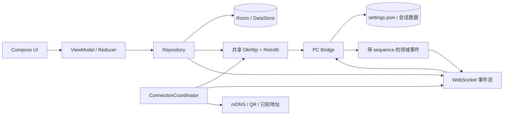

# 轻语安卓端补全、完善与优化方案

> ⚠️ **已归档（2026-09-13）**，内容不再维护。原分类：方案/。详见 [已移除/README.md](./README.md)。

> 编制日期：2026-08-29  
> 代码范围：`android/`、`electron/bridge/` 及其共享协议  
> 当前定位：PC 端「轻语」的安卓伴侣端，负责远程连接、会话消费与轻量管理，不在手机本地运行主对话模型  
> 当前代码版本：`android/gradle/libs.versions.toml` 为 `0.16.5 / versionCode 6`；`android/README.md` 仍写 `0.1.5 / build 6`，存在版本文档漂移


> 🗄️ **已归档（2026-09-13）**：本文档已移入分类 `归档/`，仅作历史留档，不再更新。归档登记见 [归档 README](./README.md)。

## 1. 执行摘要

当前安卓端已经不是 MVP：扫码和手动配对、mDNS、多 PC、REST + WebSocket、Room 离线缓存、持久化发件箱、单聊、群聊、图片、TTS、Markdown、快捷设置、长记忆、通知、应用锁、用量与公告等能力均已存在。下一阶段不应继续以“增加页面数量”为主，而应围绕四个日用指标做收口：

1. **打开即用**：已配对用户启动后直接进入主界面，连接恢复在后台完成，不再每次经过配对页。
2. **连接简单且快**：新设备扫码一次完成；已配对设备自动选择最近可用地址，网络恢复后立即重连。
3. **设置可信同步**：明确本机偏好、PC 全局设置和会话设置的所有权，提供版本、冲突和保存状态，不再依赖零散的“写完即算成功”。
4. **交互稳定顺滑**：统一页面骨架、状态反馈和组件令牌，保证小屏、大字体、横屏、弱网和长会话下仍可用。

建议按 `P0 基线收口 → P1 连接与同步 → P1 UI/性能 → P2 工程化` 四段推进。单人预计 4～6 周可形成一个适合长期日用的稳定版本；首个可感知版本可在 1～2 周内完成。

---

## 2. 当前实现审阅结论

### 2.1 已完成、无需重复建设

| 领域 | 当前实现 | 结论 |
| --- | --- | --- |
| 网络 | Retrofit/OkHttp REST、Authorization Header、WebSocket、心跳、指数退避 | 架构可沿用 |
| 可靠发送 | `requestId` 幂等、Room 发件箱、失败重试、恢复重发、`replyToId` 持久化 | 已具备可靠发送骨架 |
| 流式输出 | 100ms chunk 批量刷新，`streamingAccumulated` 跨批累积 | 旧路线图中的覆盖问题已修复 |
| 生命周期 | 前台保持 WS，后台空闲 60 秒后断开，回前台恢复 | 策略基本合理 |
| 数据 | Room 会话/消息缓存、DataStore 草稿和偏好 | 可继续演进 |
| 安全 | JWT 通过 EncryptedSharedPreferences/Keystore 落盘；Manifest 禁止全局明文；不备份应用数据 | 基础安全已收口 |
| UI | Compose + Material 3，自有 `QyColors`、字阶、圆角与间距令牌 | 不需要推翻视觉体系 |
| 功能 | 单聊、群聊、角色、快捷设置、世界书、预设、模型、长记忆、TTS、图片、通知 | 功能面已较完整 |

### 2.2 当前仍需优先解决的问题

| 优先级 | 问题 | 代码证据/影响 |
| --- | --- | --- |
| P0 | 已配对用户仍以配对页为固定起点 | `CompanionNavHost` 的 `startDestination` 固定为 `PAIRING`，增加启动步骤 |
| P0 | 设置页主题模式选择无法真正切换选项 | `OptionPickerRow` 点击时调用 `onSelect(selected)`，只会重复写入当前值 |
| P0 | 版本信息漂移 | Gradle 为 `0.16.5`，README/CHANGELOG 仍以 `0.1.5` 为主，且 `versionCode` 仍是 6 |
| P0 | 主机分类与 URL 拼接不完整 | `isPrivateHost` 主要识别 IPv4；`.local`、局域网主机名、IPv6 ULA/链路本地地址可能被误判为公网，IPv6 URL 还需要方括号 |
| P0 | 首次启动即请求通知权限 | `MainActivity` 在启动时直接请求，缺少用户触发时机与用途说明，影响首次体验 |
| P1 | 设置同步没有版本和冲突语义 | PC 已有 `GET/PATCH /api/v1/settings`，但响应没有 revision，安卓零散即时 PATCH，无法判断覆盖、陈旧数据或其他端变更 |
| P1 | 连接缺少可观测状态机 | UI 主要看到连接/重连结果，无法区分发现、探测、等待 PC 确认、鉴权失败、TLS/DNS 失败等阶段 |
| P1 | 网络恢复依赖退避计时 | 未见基于 `ConnectivityManager.NetworkCallback` 的立即重连，网络恢复后可能仍等待下一次退避 |
| P1 | HTTP/WS 客户端复用不足 | 匿名探测、鉴权 API、WebSocket 分别创建 OkHttpClient，无法充分共享 Dispatcher、连接池、DNS 与 TLS 会话 |
| P1 | WS 事件满载时可能静默丢弃 | `MutableSharedFlow(extraBufferCapacity = 256)` 配合 `tryEmit`，缺少 sequence、补拉和丢弃监控 |
| P1 | UI 文案和无障碍不足 | 大量中文硬编码在 Compose；缺少完整 string resource、TalkBack 与 200% 字体门禁 |
| P2 | UI 自动化测试不足 | 有 JVM 单测，但未发现真实 `androidTest` 主路径测试 |
| P2 | Release 工程未收口 | `isMinifyEnabled = false`，缺少明确的签名、R8、Baseline Profile、Macrobenchmark 与自动发布门禁 |

### 2.3 本次验证状态

执行 `android/gradlew.bat testDebugUnitTest` 时，Gradle 8.9 在进入项目构建前失败：JDK 17 的 `WEPollSelector/PipeImpl` 无法建立本机 loopback，根因边界位于 Gradle 单次守护进程与本机 Java 网络栈，而不是某个项目测试用例。因此本方案没有把本次结果写成“代码测试失败”；实施前仍需在正常构建环境重新建立 `test + lint + assemble` 基线。

---

## 3. 产品目标与量化指标

### 3.1 核心目标

- 首次用户只需在 PC 打开“手机连接”，安卓扫码并在 PC 确认一次。
- 已配对用户打开 App 后直接看到最近会话；连接过程不阻塞主界面。
- 发送动作立即出现本地消息，断网、切后台或进程被回收后仍可恢复。
- PC 和安卓修改同一项设置时，用户能知道最终值来自哪里，不发生静默覆盖。
- 页面在 360dp 小屏、横屏、平板、系统字体 200% 下不遮挡、不溢出。

### 3.2 建议性能 SLO

以下指标先埋点再优化，统计 P50/P95，而不是凭体感判断：

| 指标 | 局域网目标 |
| --- | ---: |
| 已配对冷启动到首屏可交互 | P95 ≤ 1.2s |
| 已配对冷启动到会话缓存可见 | P95 ≤ 800ms |
| 已知 PC 可达时，启动到 WS 已连接 | P95 ≤ 1.5s |
| 扫码完成到进入“等待 PC 确认” | P95 ≤ 700ms |
| PC 确认到进入会话列表 | P95 ≤ 1.0s |
| 点击发送到本地气泡出现 | P95 ≤ 50ms |
| WS chunk 到 Compose 可见 | P95 ≤ 150ms |
| 网络恢复到首次重连发起 | P95 ≤ 300ms |
| 200 条消息会话稳定滚动 | 目标设备无明显连续掉帧、无 OOM |
| 设置保存反馈 | P95 ≤ 500ms；超时必须显示“未同步” |

### 3.3 暂不纳入本轮

- 安卓本地大模型推理与模型包管理。
- 未经安全设计的公网裸中继。
- 为追求形式而立即引入 Hilt 或大规模多模块重构。

---

## 4. 目标架构



关键调整不是重写 Repository，而是补两个协调层：

- `ConnectionCoordinator`：负责候选地址、网络变化、探测、鉴权、重连和连接指标。
- `SettingsSyncRepository`：负责设置快照、revision、字段所有权、PATCH、冲突和事件刷新。

---

## 5. UI 与信息架构优化

### 5.1 启动与主导航

将当前“固定配对页起步”改为启动路由决策：

```text
读取本地连接（不等网络）
├─ 无已配对连接 -> 配对引导
└─ 有已配对连接 -> 主界面 + 本地缓存
                    ├─ 后台恢复成功 -> 状态变为已连接
                    ├─ 暂时离线 -> 保持缓存可读，展示轻量离线条
                    └─ 令牌失效 -> 就地提示重新配对，不清空本地缓存
```

主界面建议使用统一 `MainShell`：

- 手机底部导航：会话、角色、群聊；设置放右上角。
- 平板/横屏：NavigationRail + 会话列表/聊天双栏。
- 最近打开的主栏目和会话用 `SavedStateHandle` 恢复。
- 配对页从“每次启动首页”降为“首次引导 + 连接管理页”。

### 5.2 统一页面状态

每个列表页统一五态，避免各页面自己拼文案：

```text
Loading / Content / Empty / OfflineWithCache / ErrorRecoverable
```

建议提供公共组件：

- `QyLoadingState`：骨架屏而非整页转圈。
- `QyEmptyState`：说明原因并给一个主操作。
- `QyErrorBanner`：区分离线、401、版本不兼容、服务器拒绝。
- `QyConnectionChip`：只展示简短状态，点击展开详细诊断。
- `QyAsyncSettingRow`：显示“保存中 / 已同步 / 未同步，点击重试”。

### 5.3 设置页重组

建议按所有权而不是按技术模块分组：

1. **本机显示**：主题、字号、间距、角色背景。
2. **本机隐私与通知**：应用锁、任务预览、通知内容、免打扰。
3. **PC 对话设置**：模型、预设、流式输出、Token 显示、翻译语言等，明确标注“同步到当前 PC”。
4. **当前会话**：世界书、会话预设、长记忆、上下文用量，保留在聊天快捷设置面板。
5. **连接与数据**：当前 PC、切换/重新配对、清缓存、删除本机数据。
6. **关于与诊断**：安卓版本、PC/API 版本、网络诊断、导出脱敏日志、检查更新。

立即修复主题选择控件：`OptionPickerRow` 应打开单选弹窗/底部面板或直接渲染三个可选项，不能再次提交当前值。

### 5.4 对话页优化

保留现有反向 `LazyColumn`、稳定 key、`remember` Markdown 解析和 100ms 流式节流，在此基础上完善：

- 输入区只有一层主要操作：发送/停止；图片、续写、润色收进紧凑附件菜单，减少底部纵向占用。
- 用户向上阅读时不自动抢回底部；显示“回到最新”按钮和未读 chunk 数。
- 失败气泡显示失败类型，并区分“重试发送”和“仅重试 AI 生成”。
- 图片上传前显示压缩/上传状态；大图使用临时文件 URI，避免 Base64 长期驻留 Compose state。
- 长按菜单按角色区分可用动作，破坏性操作集中到底部并二次确认。
- 搜索结果支持“上一个/下一个”和定位高亮，不只过滤列表。

### 5.5 视觉与无障碍

现有 Morandi 暖灰设计令牌可以保留，重点做一致性而非换皮：

- 所有间距回归 4/8dp 网格，页面横向边距统一为 16dp。
- 最小触控区域 48dp；图标必须有 `contentDescription` 或明确标为装饰。
- 用户可见文本迁移到 `strings.xml`；随后补简体中文之外的资源。
- 验证 TalkBack 焦点顺序、颜色对比、减少动画设置和系统字体 200%。
- 使用窗口尺寸类，不以固定 `312dp` 等常量决定核心布局宽度。

---

## 6. 设置同步完善方案

### 6.1 先定义所有权

| 设置类型 | 示例 | 权威端 | 同步策略 |
| --- | --- | --- | --- |
| 安卓本机偏好 | 主题、聊天字号、消息间距、角色背景 | Android | 仅本机 DataStore，不回写 PC |
| 安卓安全与通知 | 应用锁、任务预览、通知隐藏、免打扰 | Android | 仅本机；不允许 PC 远程关闭 |
| PC 全局对话设置 | 当前模型、全局预设、流式、翻译语言、Token 显示 | PC | PC 为权威；安卓读取并经受控 PATCH 修改 |
| 会话级设置 | 世界书、会话预设、长记忆模式/间隔 | PC 会话 | 按 sessionId 修改，服务端回传新快照 |
| 敏感设置 | API Key、供应商凭据、服务器私钥 | PC | 永不下发安卓 |

禁止把所有设置做成“最后写入者获胜”的无差别双向同步。尤其本机隐私设置不能被 PC 覆盖，敏感字段不能进入移动端 DTO。

### 6.2 协议升级

建议将设置响应升级为：

```json
{
  "schemaVersion": 2,
  "revision": 143,
  "updatedAt": 1788000000000,
  "updatedBy": "android:device-id",
  "values": {
    "activeModel": "...",
    "activePresetId": "...",
    "translationTargetLang": "中文"
  },
  "capabilities": ["settings_patch_v2", "session_settings_v2"]
}
```

PATCH 请求携带 `baseRevision`，服务端采用以下语义：

- revision 一致：应用白名单字段并返回完整新快照。
- revision 冲突：返回 `409` 和当前服务端快照；安卓提示“设置已在 PC 更新”，允许加载 PC 值或重新应用本次改动。
- 未知字段：忽略并在响应给出 `rejectedFields`，不能静默伪装为保存成功。
- 敏感字段：服务端拒绝并记录安全日志。

PC 在设置落盘后通过 WS 广播 `settings:updated { revision, changedFields }`。安卓收到后只增量刷新相关区域；WS 断线重连后再 GET 一次完整快照完成对账。

### 6.3 Android 数据流

`SettingsSyncRepository` 建议暴露：

```kotlin
StateFlow<SettingsSnapshot>
StateFlow<SyncStatus> // Idle / Saving / Synced / Conflict / Failed
suspend fun refresh()
suspend fun patch(change: SettingsPatch)
```

实现规则：

- 进入设置页不重复并发请求；Repository 级缓存当前 PC 的快照。
- UI 可乐观更新，但保存失败必须回滚或显示“未同步”。
- 切换 PC 时按 `deviceId` 隔离快照，禁止把 A 的值展示/提交到 B。
- 断网期间不排队模型/预设等可能改变对话行为的全局设置；保留草稿并提示恢复网络后确认。
- 对无风险的显示型 PC 设置可选做待提交队列，但仍要携带 baseRevision。

### 6.4 设置同步验收

- Android 修改翻译语言，PC 1 秒内刷新；PC 再修改，Android 1 秒内刷新。
- 两端同时修改同一字段时出现明确冲突，不静默覆盖。
- 切换 PC 后 300ms 内展示本地缓存快照，并在后台刷新。
- 断线、401、500、JSON 新增字段均有自动化测试。
- 抓包确认 API Key、连接 Profile 和凭据不进入响应。

---

## 7. 连接步骤简化方案

### 7.1 新用户流程

建议压缩为三步：

1. PC 打开“设置 → 手机连接”，自动显示二维码和剩余有效时间。
2. Android 点击“扫码连接”；识别后直接进入“正在连接 / 等待 PC 确认”。
3. PC 确认后，Android 自动进入会话列表。

手动 IP/端口/配对码降为“无法扫码？”的高级入口。mDNS 发现列表应直接展示“发现的轻语 PC”，点击后若能匹配二维码/配对请求则继续，不要只写“填入”让用户再理解表单。

### 7.2 QR v2

二维码建议包含：

```text
scheme, serverId, displayName, apiVersion,
pairingCode, expiresAt, preferredAddress,
alternativeAddresses[], port, tlsMode
```

要求：

- 配对码一次性、短时有效且使用后失效。
- `serverId` 是稳定 PC 身份，不能继续把 pairingCode 当服务器指纹。
- 支持应用内扫码和 `qingyu://pair?...` 深链。
- Android 展示 PC 名称和指纹摘要，再等待 PC 确认。
- 旧二维码继续兼容一个版本周期。

### 7.3 已配对用户流程

- 本地保存每台 PC 的稳定 `serverId`、最近成功地址、候选地址和最后成功时间。
- 启动后先展示缓存，同时并行探测最近地址、mDNS 地址和二维码保存的候选地址。
- 同一 PC 多地址采用“先成功者胜出”，取消其余探测。
- 已配对设备只要 token 有效即可自动恢复，不再要求重新输入配对码。
- 令牌失效只针对当前 PC 提示重新配对，不自动删除缓存与其他 PC。

### 7.4 连接状态机

```text
Idle
 -> Discovering
 -> Probing(addresses)
 -> PairingAwaitingApproval / Authenticating
 -> ConnectingWs
 -> Connected
 -> Degraded(rest可用/ws不可用)
 -> Reconnecting
 -> NeedsRepair(401/证书或指纹变化/版本不兼容)
```

UI 对用户显示简短中文；诊断页保留错误码、地址、耗时和最后成功时间。不要把 DNS、TLS、超时和 PC 未开启都显示成同一句“无法连接 PC”。

---

## 8. 连接延迟与弱网优化

### 8.1 先埋点

为每次连接生成 `connectionAttemptId`，记录但不上传敏感内容：

- discoveryStart/discoveryHit
- dnsStart/dnsEnd
- tcpConnect/tlsHandshake
- serverInfoEnd/pairRequestEnd
- wsOpen/firstEvent
- reconnectReason/backoffMs/networkType

在“关于与诊断”提供本机查看和脱敏导出。没有指标前，不应简单把所有 timeout 调小。

### 8.2 客户端复用

- 共享 OkHttp `Dispatcher`、`ConnectionPool`、DNS 与基础拦截器。
- 鉴权/匿名请求用同一基础 Client 的 `newBuilder()`，不要每个 API 实例建立独立资源池。
- WebSocket 复用相同底层 Client；切换 PC 时用连接代次/`deviceId` 严格隔离回调。
- Retrofit 只按规范化 baseUrl 缓存；切换、移除和凭据变化时精确失效。
- Coil、TTS、REST 使用一致的连接选择和鉴权来源，避免媒体仍访问旧 PC。

### 8.3 地址与网络变化

- 完整支持 IPv4、IPv6 ULA、链路本地地址、`.local` 和局域网主机名；IPv6 URL 正确加 `[]`。
- 使用 `ConnectivityManager.NetworkCallback`：网络变为 available 时取消旧退避并立即探测；网络丢失时暂停无意义重试。
- 对 Wi-Fi/移动网络切换建立新连接代次，旧 socket 回调不得改变新状态。
- 重连退避增加 jitter，建议 0s、1s、2s、4s、8s、15s、30s，上限 30s；网络恢复事件可重置。

### 8.4 数据与事件

- 会话列表首屏先读 Room，再增量对账，不阻塞显示。
- `session:updated` 不要每次触发整页 `loadLatest()`；事件包含 message/session revision，能增量合并则增量合并，无法确认时再补拉。
- WS 事件增加单调 `sequence`。Android 保存最后确认值，检测缺口后调用 `GET /events?after=` 或重新拉取相关会话。
- 为 `tryEmit` 失败计数并触发对账，禁止静默丢事件。
- chunk 节流根据设备帧率和积压动态取 50～120ms；后台可降低刷新频率，但不能影响最终完整消息。

---

## 9. 稳定性、安全与数据治理

### 9.1 可靠发送状态机

在现有 Room outbox 基础上统一状态：

```text
queued -> sending -> user_committed -> awaiting_ai -> completed
            \-> failed_send              \-> failed_generation
```

- “用户消息是否已落盘”和“AI 是否完成”必须分开。
- 重试 AI 不得重复发送用户消息。
- Outbox 保留 requestId、sessionId、characterId、content、images、replyToId、retryCount、lastError。
- 图片先写应用缓存文件并维护引用计数；完成/取消后清理孤儿文件。
- 切换 PC 时暂停旧 PC 的队列，不允许向新 PC 自动发送。

### 9.2 安全

- 继续保持 token 只走 Authorization Header，Release 日志禁止正文、token、配对码和完整 URL query。
- 新配对记录稳定服务器身份；后续若身份变化，必须阻断并要求用户确认，不能静默接受。
- 局域网明文只对白名单私网/本地域开放；公网强制 TLS。
- 应用锁开启时进入后台再次解锁的时机要可配置；认证失败不能通过无凭据设备直接绕过。
- Android 13+ 通知权限改为用户开启“任务通知”或首次生成长任务时再申请，并在申请前解释用途。
- 提供“清缓存”“移除当前 PC”“清除全部本机数据”三个不同级别，文案明确是否影响 PC 数据。

### 9.3 数据迁移

当前 Room 使用 `fallbackToDestructiveMigration()`，正式稳定版前应：

- 为缓存和 outbox 的 schema 变更提供显式 migration。
- 只有可完全重建的纯缓存表允许破坏性迁移；发件箱、草稿和连接记录不得静默丢失。
- 为升级/降级、损坏恢复和磁盘满建立测试与用户提示。

---

## 10. 工程质量与测试

### 10.1 自动化门禁

每个 PR 至少执行：

```text
testDebugUnitTest
lintDebug
assembleDebug
```

发布标签执行：

```text
clean -> test -> lint -> assembleRelease/bundleRelease
-> 签名 -> APK/AAB SHA-256 -> 安装冒烟 -> 发布
```

### 10.2 测试重点

**JVM/Repository**

- 连接状态机、候选地址竞速、网络恢复取消退避。
- 多 PC 切换时 REST/WS/Coil/TTS 不串台。
- 设置 revision 成功、409 冲突、401、断线和新增字段。
- WS sequence 缺口、重复、乱序和缓冲溢出后的补拉。
- Outbox 进程恢复、图片、引用和“仅重试 AI”。

**Compose UI**

- 首次启动 → 权限解释 → 扫码 → 等待确认 → 会话列表。
- 已配对冷启动直接进入会话列表，离线缓存仍可读。
- 主题真实切换、设置保存状态和同步冲突。
- 键盘、横屏、360dp、小屏、平板和字体 200%。
- TalkBack 主路径与破坏性操作确认。

**真机/模拟器端到端**

- Android 8/9、Android 13+、一种国产 ROM、省电模式。
- Wi-Fi 断开/恢复、Wi-Fi 与移动网络切换、PC 休眠/唤醒。
- 200/1000 条长会话、连续流式输出、20 次切前后台。
- 扫码权限拒绝、通知权限拒绝、相册取消和磁盘空间不足。

### 10.3 性能工具

- Macrobenchmark：冷启动、会话打开、长列表滚动。
- Baseline Profile：主启动和打开会话路径。
- Compose recomposition 统计：聊天 chunk、高频状态条和图片列表。
- Perfetto/gfxinfo：定位 jank，不以主观动画感受代替数据。

---

## 11. 分阶段实施计划

### 阶段 A：P0 基线收口（2～4 天）

- 修复主题选择控件。
- 已配对启动路由改为直达主界面。
- 统一 `0.16.5/versionCode/README/CHANGELOG` 的版本单源。
- 修正主机分类、IPv6 URL 和 `.local` 处理并补测试。
- 通知权限改为场景触发。
- 在正常环境恢复 `test + lint + assemble` 绿色基线。

**交付**：启动步骤明显减少，当前可复现缺陷清零，具备继续优化的可靠基线。

### 阶段 B：连接与延迟（1 周）

- 引入 `ConnectionCoordinator` 和明确状态机。
- 共享 OkHttp 资源，缓存规范化 Retrofit/API。
- NetworkCallback 立即重连、候选地址并行探测、jitter 退避。
- 增加连接耗时埋点与诊断页。
- QR v2/稳定 serverId 先完成协议设计和兼容解析。

**交付**：已配对自动恢复、连接失败可诊断、网络恢复更快。

### 阶段 C：设置同步（1 周）

- PC 设置响应增加 schemaVersion/revision/capabilities。
- PATCH 增加 baseRevision、409 和 rejectedFields。
- WS 增加 settings:updated。
- Android 增加 `SettingsSyncRepository`、保存状态和冲突 UI。
- 对所有设置字段完成所有权清单和敏感字段审计。

**交付**：设置修改可追踪、可确认、可冲突恢复。

### 阶段 D：UI 与移动体验（1～2 周）

- MainShell、统一五态组件、设置页重组。
- 对话输入区、搜索定位、图片上传状态和失败动作优化。
- 自适应布局、资源化、TalkBack、大字体。
- 完成 Compose UI 主路径测试。

**交付**：交互一致、信息层级清晰、手机和平板均可用。

### 阶段 E：可靠性与发布（1 周）

- WS sequence/补拉、Outbox 状态细分、显式 Room migration。
- Macrobenchmark/Baseline Profile。
- Release R8、签名、校验值、自动更新与回滚说明。
- 真机弱网与长会话压力测试。

**交付**：可长期发布维护的稳定版本。

---

## 12. 建议立即创建的任务清单

| ID | 任务 | 优先级 | 主要位置 | 验收摘要 |
| --- | --- | --- | --- | --- |
| A-01 | 修复主题选择器 | P0 | `SettingsScreen.kt` | 三种主题均可选择并重启保持 |
| A-02 | 已配对启动直达主界面 | P0 | `CompanionNavHost.kt`、`AppContainer.kt` | 不经过配对页，缓存先显示 |
| A-03 | 版本单源与发布校验 | P0 | `libs.versions.toml`、README、CHANGELOG | versionName/versionCode/文档一致 |
| A-04 | 完整主机/IP 规范化 | P0 | `NetworkModule.kt` | IPv4/IPv6/.local/主机名测试通过 |
| A-05 | 延迟通知权限请求 | P0 | `MainActivity.kt`、设置页 | 首启不弹，触发前有解释 |
| B-01 | 连接状态机 | P1 | `network/` | 每种失败可区分且可恢复 |
| B-02 | NetworkCallback 快速重连 | P1 | `network/` | 网络恢复 300ms 内发起 |
| B-03 | 共享 OkHttp 资源 | P1 | `NetworkModule.kt`、`WsClientImpl.kt` | REST/WS/媒体不串台且连接复用 |
| B-04 | 连接指标与诊断页 | P1 | `network/`、`ui/settings/` | 可导出脱敏诊断 |
| C-01 | Settings v2 revision 协议 | P1 | `electron/bridge/routes.ts` | PATCH 冲突返回 409 快照 |
| C-02 | SettingsSyncRepository | P1 | `android/data/` | 按 PC 隔离、保存状态完整 |
| C-03 | settings:updated 事件 | P1 | PC bridge WS + Android WS | PC/安卓修改 1s 内同步 |
| D-01 | MainShell 与统一状态组件 | P1 | `ui/navigation/`、`ui/components/` | 页面状态和入口一致 |
| D-02 | 对话输入区与错误动作 | P1 | `ui/chat/` | 发送/停止/重试语义清楚 |
| D-03 | 自适应与无障碍 | P1 | 全部 UI | 360dp/平板/200% 字体/TalkBack |
| E-01 | WS sequence 与缺口补拉 | P1 | PC bridge + Android | 丢帧/乱序最终一致 |
| E-02 | Room 显式迁移 | P1 | `CacheDatabase.kt` | 发件箱/草稿升级不丢失 |
| E-03 | UI/E2E 与性能门禁 | P2 | `androidTest`、benchmark | 主流程、冷启动、滚动纳入 CI |
| E-04 | Release 收口 | P2 | Gradle/CI | R8、签名、SHA-256、安装冒烟 |

---

## 13. 完成定义

本轮优化完成时应同时满足：

- [ ] 未配对用户三步完成配对；已配对用户打开 App 直接看到会话缓存。
- [ ] 局域网连接、网络恢复和发送延迟达到第 3.2 节 SLO，且有数据可查。
- [ ] 本机设置、PC 全局设置、会话设置和敏感设置的所有权清晰。
- [ ] PC/Android 同时改设置不会静默覆盖，失败不会显示成“已保存”。
- [ ] IPv4、IPv6、`.local`、Tailscale/ZeroTier 常见地址均能正确建立对应安全连接。
- [ ] 切换 PC 时 REST、WS、图片、TTS、设置缓存和发件箱均不串台。
- [ ] 断网、切后台、进程回收后消息最终不丢、不重复，引用和图片语义保持。
- [ ] 360dp、横屏、平板、系统字体 200% 和 TalkBack 主路径通过。
- [ ] `testDebugUnitTest`、`lintDebug`、`assembleDebug`、Release 构建与安装冒烟全部通过。
- [ ] 版本号、更新日志、APK/AAB 和校验值由同一发布流程产生。

完成以上工作后，轻语安卓端将从“功能齐全的伴侣端开发版”转为“连接简单、设置可信、弱网可靠、可以长期日用和持续发布的移动端”。
