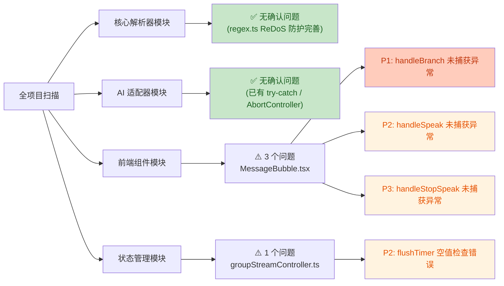
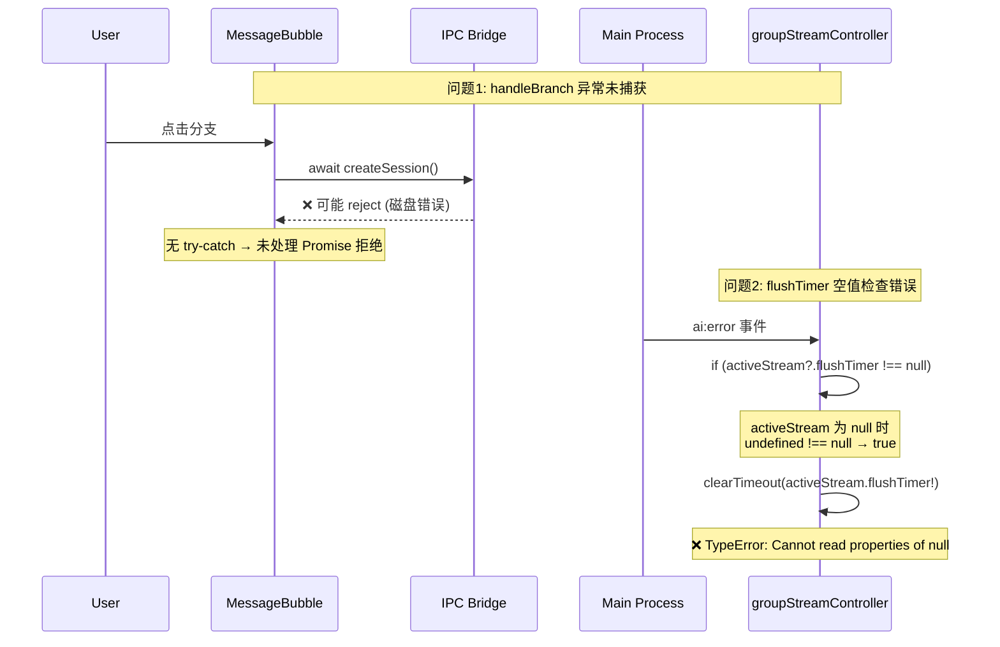

# 代码审查报告

> 审查日期: 2026-08-02
> 审查范围: 全项目扫描
> 审查工具: 静态代码分析 + 人工复核

---

## 审查概览

本次对项目进行了全量代码扫描,覆盖以下模块:

- 核心解析器 (`src/utils/`)
- AI 适配器与服务 (`electron/services/`)
- 前端组件 (`src/components/`)
- 状态管理 (`src/store/`)

经过 4 个并行搜索代理初步扫描 + 逐文件人工复核验证,排除了大量误报后,确认以下 **4 个真实问题**。

### 问题分布



### 问题调用链



---

## 确认问题清单

| 编号 | 严重级别 | 问题标题 | 所在文件 | 行号 |
|------|----------|----------|----------|------|
| 1 | P1 严重 | `handleBranch` 多个 await 调用未捕获异常,IPC 失败导致未处理拒绝 | `src/components/chat/MessageBubble.tsx` | 242-261 |
| 2 | P2 中等 | `groupStreamController` 错误处理中 `flushTimer` 空值检查逻辑错误,导致 TypeError | `src/store/groupStreamController.ts` | 520-522 |
| 3 | P2 中等 | `handleSpeak` 整个函数缺少 try-catch,TTS IPC 失败导致状态卡死 | `src/components/chat/MessageBubble.tsx` | 148-214 |
| 4 | P3 轻微 | `handleStopSpeak` 中 `await window.api.tts.stop()` 未捕获异常 | `src/components/chat/MessageBubble.tsx` | 216-220 |

---

## 问题详情

### 问题 1: `handleBranch` 未捕获异常 (P1)

**文件**: [MessageBubble.tsx](file:///d:/Code/酒馆/src/components/chat/MessageBubble.tsx#L242-L261)

**问题描述**:
`handleBranch` 函数包含 4 个 `await` IPC 调用(`createSession`、`saveMessage`、`listSessions`、`listMessages`),全部未包裹 `try-catch`。若任一调用因磁盘错误、IPC 通道异常等原因 reject,将产生未处理的 Promise 拒绝,并可能导致:

- 分支会话已创建但消息未完整保存(数据不一致)
- 会话列表未刷新(UI 显示陈旧)
- `useChatStore` 状态与实际持久化数据脱节

**问题代码**:
```typescript
const handleBranch = async () => {
    if (!character) return
    const branchSession = await window.api.chat.createSession(...)  // ← 可能 reject
    if (!branchSession) return
    const { messages } = useChatStore.getState()
    const branchIdx = messages.findIndex((m) => m.id === message.id)
    if (branchIdx < 0) return
    const branchMsgs = messages.slice(0, branchIdx + 1)
    for (const msg of branchMsgs) {
      const branchMsg = { ...msg, id: `${msg.id}_b`, ... }
      await window.api.chat.saveMessage(branchMsg)  // ← 可能 reject
    }
    const sessions = await window.api.chat.listSessions(...)  // ← 可能 reject
    useChatStore.setState({ sessions, currentSessionId: branchSession.id })
    const branchMessages = await window.api.chat.listMessages(...)  // ← 可能 reject
    useChatStore.setState({ messages: branchMessages })
  }
```

**修复建议**:
包裹 `try-catch`,失败时回滚已创建的分支会话并向用户提示错误。

```typescript
const handleBranch = async () => {
    if (!character) return
    try {
      const branchSession = await window.api.chat.createSession(...)
      if (!branchSession) return
      // ... 其余逻辑
    } catch (err) {
      console.error('创建分支失败:', err)
      // 可选: 回滚已创建的 branchSession
      // 向用户提示错误(通过 toast / 错误状态)
    }
  }
```

---

### 问题 2: `groupStreamController` flushTimer 空值检查错误 (P2)

**文件**: [groupStreamController.ts](file:///d:/Code/酒馆/src/store/groupStreamController.ts#L520-L522)

**问题描述**:
错误处理回调中使用 `!== null` 严格不等比较来判断 `flushTimer` 是否存在,逻辑存在缺陷:

```typescript
if (activeStream?.flushTimer !== null) {  // ← 逻辑错误
  clearTimeout(activeStream.flushTimer!)
}
```

当 `activeStream` 为 `null` 或 `undefined` 时:
- `activeStream?.flushTimer` 短路求值为 `undefined`
- `undefined !== null` 结果为 `true`(严格不等)
- 进入分支后 `activeStream.flushTimer!` 抛出 `TypeError: Cannot read properties of null`

**触发条件**:
当 `ai:done` 与 `ai:error` 事件近乎同时到达时,`done` 处理器先执行 `cleanupActiveStream()` 将 `activeStream` 置空,随后 `error` 处理器触发该缺陷。

**对比参考**:
同项目 `streamController.ts` 使用了正确的写法:
```typescript
// streamController.ts L597 (正确写法)
if (activeStream?.flushTimer) clearTimeout(activeStream.flushTimer)
```

**修复建议**:
```typescript
// 修复: 使用 != 松散比较(同时排除 null 和 undefined),或使用 truthy 检查
if (activeStream?.flushTimer != null) {
  clearTimeout(activeStream.flushTimer)
  activeStream.flushTimer = null
}
```

---

### 问题 3: `handleSpeak` 未捕获异常 (P2)

**文件**: [MessageBubble.tsx](file:///d:/Code/酒馆/src/components/chat/MessageBubble.tsx#L148-L214)

**问题描述**:
`handleSpeak` 函数(148-214 行)整体未包裹 `try-catch`,内部包含多个可能 reject 的异步调用:

| 行号 | 调用 | 失败原因 |
|------|------|----------|
| 168 | `await window.api.tts.speak(...)` | TTS 服务异常、API Key 错误 |
| 193 | `await audio.play()` | 浏览器自动播放策略拦截 |
| 201 | `await window.api.tts.pause()` | IPC 通道异常 |
| 204 | `await window.api.tts.resume()` | IPC 通道异常 |
| 207 | `await window.api.tts.speak(...)` | TTS 服务异常 |

若任一调用 reject,将导致:
- 未处理的 Promise 拒及(控制台报错)
- `ttsState` 卡在中间状态(如 `'speaking'`),按钮无法再次响应

**问题代码**:
```typescript
const handleSpeak = async () => {
    if (!message.content) return
    // ... 预处理
    if (ttsConfig.provider === 'openai' || ttsConfig.provider === 'edge') {
      // ...
      const res = await window.api.tts.speak(...)  // ← 无 try-catch
      if (res.success && res.audioBase64) {
        const audio = new Audio(...)
        await audio.play().catch(() => setTtsState('idle'))  // ← 仅此处有 catch
      } else {
        setTtsState('idle')
      }
      return
    }
    // ...
    await window.api.tts.speak(...)  // ← 无 try-catch
    setTtsState('speaking')
  }
```

**修复建议**:
整个函数体包裹 `try-catch`,失败时确保 `ttsState` 重置为 `'idle'`。

```typescript
const handleSpeak = async () => {
    if (!message.content) return
    try {
      // ... 现有逻辑
    } catch (err) {
      console.error('TTS 播放失败:', err)
      setTtsState('idle')
    }
  }
```

---

### 问题 4: `handleStopSpeak` 未捕获异常 (P3)

**文件**: [MessageBubble.tsx](file:///d:/Code/酒馆/src/components/chat/MessageBubble.tsx#L216-L220)

**问题描述**:
`handleStopSpeak` 中 `await window.api.tts.stop()` 未捕获异常,若 IPC 调用失败,`ttsState` 仍被设为 `'idle'`(因 `setTtsState` 在 catch 外),但会产生未处理拒绝。

**问题代码**:
```typescript
const handleStopSpeak = async () => {
    audioRef.current?.pause()
    audioRef.current = null
    await window.api.tts.stop()  // ← 可能 reject
    setTtsState('idle')
  }
```

**修复建议**:
```typescript
const handleStopSpeak = async () => {
    audioRef.current?.pause()
    audioRef.current = null
    try {
      await window.api.tts.stop()
    } catch (err) {
      console.error('TTS 停止失败:', err)
    }
    setTtsState('idle')
  }
```

---

## 审查通过项(无问题)

以下模块经核实**未发现真实问题**,实现质量良好:

| 模块 | 核实结论 |
|------|----------|
| `src/utils/regex.ts` | ReDoS 防护完善:模式长度限制(500)、文本长度限制(200k)、try-catch 包裹 |
| `src/utils/messagePostProcess.ts` | 空值检查到位(`if (!messages \|\| messages.length === 0)`)、`content ?? ''` 兜底 |
| `src/utils/dialogue-parser.ts` | `exec()!.index` 虽用非空断言,但所在分支已保证 fullMatch 含冒号,安全 |
| `electron/services/ai.ts` | `activeRequests.delete()` 在 `finally` 块中正确清理,无内存泄漏 |
| `electron/services/toolLoop.ts` | 工具执行前检查 `effectiveSignal.aborted`,中止逻辑正确 |
| `electron/services/adapters/gemini.ts` | JSON.parse 在 try-catch 内,L248-254 已用单调计数器替代 Date.now() |
| `electron/services/adapters/ollama.ts` | L167-177 流式 JSON.parse 已包裹 try-catch |
| `electron/services/adapters/openai.ts` | streamedToolCalls 去重累积逻辑完善,L156-162 有降级解析 |
| `src/store/streamController.ts` | flushTimer/timeoutHandle 均使用 `?.` + truthy 检查,清理正确 |
| `src/store/useChatStore.ts` | translateFlushTimer 在 done/error/无 profile 三处均有清理 |
| `src/components/character/CharacterDetail.tsx` | 可选链 + 空值合并兜底,无空引用风险 |
| `src/components/common/MarkdownImage.tsx` | 简洁健壮,onError 重试机制合理 |
| 全项目 | 无 `dangerouslySetInnerHTML` 使用,无 XSS 风险 |

---

## 建议优先级

| 优先级 | 问题 | 建议 |
|--------|------|------|
| 🔴 立即修复 | 问题 1 (handleBranch) | 可能导致数据不一致,影响用户数据完整性 |
| 🟡 尽快修复 | 问题 2 (flushTimer) | 罕见但触发时导致流式响应卡死 |
| 🟡 尽快修复 | 问题 3 (handleSpeak) | 影响日常使用体验,TTS 按钮卡死 |
| 🟢 可选修复 | 问题 4 (handleStopSpeak) | 影响轻微,仅控制台告警 |

---

*报告结束*
